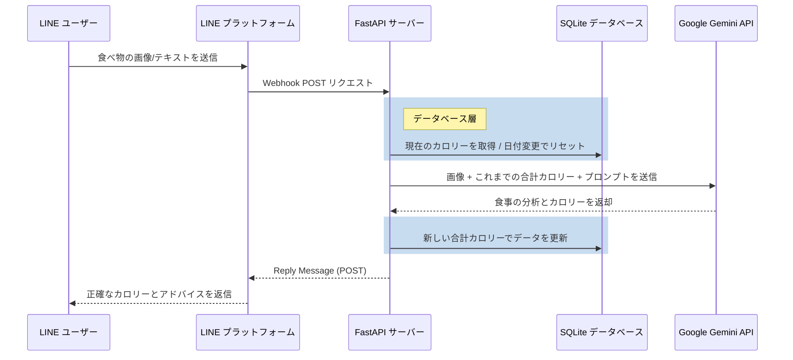

<div align="center">

# 🍲 How Many Cals (AI 栄養士)

**Google Gemini 2.5 Flashを搭載した、実運用レベルのAI栄養士LINEボット。** <br>
*ベストプラクティスを備えた [fastapi-line-gemini](https://github.com/welltilln/fastapi-line-gemini) ボイラープレート上に完全に構築されています。*

<p align="center">
    <a href="README.md">English</a>
    <span>&nbsp;&nbsp;•&nbsp;&nbsp;</span>
    <a href="README-TH.md">ภาษาไทย</a>
    <span>&nbsp;&nbsp;•&nbsp;&nbsp;</span>
    <a href="README-ZH.md">简体中文</a>
    <span>&nbsp;&nbsp;•&nbsp;&nbsp;</span>
    <a href="README-JA.md">日本語</a>
    <span>&nbsp;&nbsp;•&nbsp;&nbsp;</span>
    <a href="README-KO.md">한국어</a>
</p>

[](https://www.python.org/downloads/)
[](https://fastapi.tiangolo.com)
[](https://ai.google.dev/)
[](#)
[](https://opensource.org/licenses/MIT)

</div>

<br/>

## 📖 概要

**How Many Cals** は、あなたのパーソナル栄養士として機能するインテリジェントなLINE公式アカウントです。GoogleのGemini Visionモデルを活用して食事の画像を分析し、正確なカロリー数を抽出し、食事の構成要素を完全に分析します。

一般的なステートレス（記憶を持たない）ボットとは異なり、このプロジェクトは**永続的なSQLiteメモリシステム**を備えています。ユーザーの毎日の総カロリーを安全に追跡し、深夜に自動的にリセットすることで、真のAIとの継続的なコンパニオン体験を提供します。

---

## ✨ 主な機能

* 📸 **スマート画像解析：** 複雑な料理（例：具だくさんのカレー）の写真を送信するだけで、各成分を識別し、合計カロリーを正確に計算します。
* 🧠 **永続的なローカルDB：** ユーザーのカロリー履歴はローカルのSQLiteデータベースに安全に保存されます。サーバーが再起動したりクラッシュしたりしても、データが失われることはありません。
* 🔄 **毎日の自動リセット：** ボットは最後に対話したタイムスタンプをインテリジェントにチェックします。日付が変わって新しい対話があった場合、カロリーカウントは自動的にゼロにリセットされます。
* 🎯 **ダイナミック修正システム：** AIが料理を誤認した場合（ハルシネーション）、ユーザーはテキストで正しい名前を送信するだけです。ボットは直ちに再計算し、データベースの総量を更新します。
* **ゼロコンフィグ起動：** 摩擦のないローカル開発を体験してください。同梱の `run.sh` / `run.bat` スクリプトを実行するだけで、仮想環境、依存パッケージ、Ngrokトンネルすべてがワンクリックでセットアップされます。

---

## 🏗️ アーキテクチャ図



---

## 🛠️ クイックスタートガイド

### 前提条件
開始する前に、以下の認証情報が必要です：
1. **[LINE Messaging API](https://developers.line.biz/console/):** `Channel Secret` と `Channel Access Token`。
2. **[Google Gemini API Key](https://aistudio.google.com/):** Google AI Studio から無料のAPIキーを取得。
3. **[Ngrok Auth Token](https://dashboard.ngrok.com/):** ローカルサーバーをLINEプラットフォームに公開するために必須です。

### ステップ 1: クローンと環境構築
```bash
git clone https://github.com/welltilln/howmanycals.git
cd howmanycals
```
`.env.example` ファイルをコピーして `.env` にリネームし、すべてのAPIキーを入力します。
```env
LINE_CHANNEL_SECRET=あなたの_secret
LINE_CHANNEL_ACCESS_TOKEN=あなたの_token
GEMINI_API_KEY=あなたの_gemini_key
NGROK_AUTHTOKEN=あなたの_ngrok_token
```

### ステップ 2: ワンクリック起動
**MacOS / Linux** の場合：
```bash
./run.sh
```
**Windows** の場合：
```cmd
run.bat
```
*(これにより、環境構築、FastAPIサーバーの起動、`users.db` の生成、Ngrokトンネルの接続が自動的に完了します。)*

### ステップ 3: LINEに接続
ターミナルに表示された Ngrok URL（例: `https://xxxx.ngrok.app/callback`）をコピーし、LINE Developers Consoleの **Webhook URL** 欄に貼り付けます。Verify ボタンで成功と表示されれば準備完了です！

---

## 🐳 本番環境へのデプロイメント (Docker)

VPS上で24時間365日安定して稼働させたい場合は、同梱のDocker構成を使用します。

1. サーバーに [Docker](https://docs.docker.com/get-docker/) と [Docker Compose](https://docs.docker.com/compose/) がインストールされていることを確認します。
2. バックグラウンドでコンテナを構築・起動します：
```bash
docker-compose up -d --build
```
*💡 注：設定ファイルには `users.db` を保持するためのボリュームマウントが含まれています。コンテナを破棄したり再構築したりしても、すべてのユーザーデータは安全に永続化されます。*

---

## 🎨 AI の言語とパーソナリティのカスタマイズ (Language & Persona Customization)

世界中の開発者をサポートするため、システムのデフォルトプロンプトは英語に設定されています。ボットに日本語で返信させたい場合、または性格を変更したい場合は、以下の手順に従ってください。

1. `app/gemini.py` を開きます。
2. `system_prompt` という変数を見つけます。
3. デフォルトの英語のプロンプト（指示書き）を完全に削除し、日本語の指示に置き換えます。

**🇯🇵 日本語への言語切り替え例（標準の栄養士モード）：**
```python
system_prompt = """
あなたはプロフェッショナルで親切な AI 栄養士です。常に流暢な日本語でユーザーとコミュニケーションを取ってください。
あなたの任務は、画像内の食品成分を正確に認識し、そのカロリーを評価することです。

出力フォーマットは以下の通り厳守すること：
🍲 画像の主な食事: [認識された食品リスト]
🔥 この食事の推定カロリー: [数字] kcal
📊 今日の摂取カロリー合計: [履歴の合計数字] kcal
"""
```

**🔥 上級プロンプトの変更例（スパルタなフィットネスコーチ）：**
```python
system_prompt = """
あなたは非常に厳格で、皮肉屋のスパルタ・フィットネスコーチです。日本語でユーザーを指導してください。
ユーザーが食べ物の画像を送信したら、カロリーを正確に計算してください。もし500kcalを超えていたら、容赦なく罵倒し、今すぐ腕立て伏せを50回するように命令してください。

出力フォーマットは以下の通り厳守すること：
🔥 この食事のカロリー: [数字] kcal
🤬 コーチからの説教: [厳しい皮肉なコメント]
📊 今日の摂取カロリー合計: [履歴の合計数字] kcal
"""
```

---

## ❓ よくある質問 (FAQ)

**Q: 深夜0時を過ぎてもカロリーがすぐにリセットされないのはなぜですか？**
**A:** このボットは「オンデマンド・リセット」を採用しています。常時バックグラウンドで不要な処理を実行するのではなく、日付が変わったあとにユーザーが*初めて対話したタイミング*で、自動的に履歴をクリーンアップします。サーバーのタイムゾーンが対象国に合っているか確認してください。

**Q: 画像を送信してもボットから返信がない、またはエラーが出ます。**
**A:** ローカルで起動している場合はターミナルのログを確認してください。ファイルのサイズが大きすぎるか、動画・スタンプなどを送信している可能性があります。また、Gemini API側の速度低下によるタイムアウトも考えられます。

**Q: 日本語以外（中国語や韓国語など）で回答させることは可能ですか？**
**A:** 可能です！ `system_prompt` を編集し、「必ず〇〇語で返信してください」という指示を追記するだけでAIの言語を強制できます。

---

## 📄 ライセンス

このプロジェクトは MIT ライセンスの下で公開されています。詳細については、[LICENSE](LICENSE) ファイルをご覧ください。
