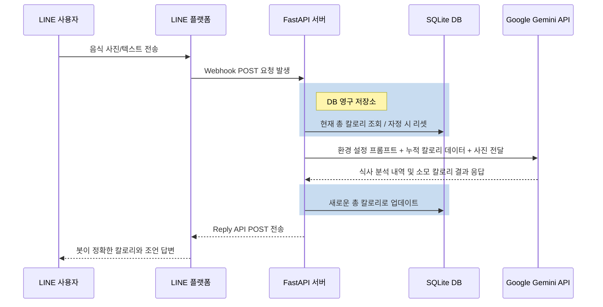

<div align="center">

# 🍲 How Many Cals (AI 영양사)

**Google Gemini 2.5 Flash로 구동되는 프로덕션 레벨의 AI 영양사 LINE 봇입니다.** <br>
*최고의 구조를 갖춘 [fastapi-line-gemini](https://github.com/welltilln/fastapi-line-gemini) 보일러플레이트를 기반으로 완벽하게 구축되었습니다.*

<p align="center">
    <a href="README.md">English</a>
    <span>&nbsp;&nbsp;•&nbsp;&nbsp;</span>
    <a href="README-TH.md">ภาษาไทย</a>
    <span>&nbsp;&nbsp;•&nbsp;&nbsp;</span>
    <a href="README-ZH.md">简体中文</a>
    <span>&nbsp;&nbsp;•&nbsp;&nbsp;</span>
    <a href="README-JA.md">日本語</a>
    <span>&nbsp;&nbsp;•&nbsp;&nbsp;</span>
    <a href="README-KO.md">한국어</a>
</p>

[](https://www.python.org/downloads/)
[](https://fastapi.tiangolo.com)
[](https://ai.google.dev/)
[](#)
[](https://opensource.org/licenses/MIT)

</div>

<br/>

## 📖 개요

**How Many Cals** 는 개인 영양사 역할을 하는 지능형 LINE 공식 계정입니다. Google의 Gemini Vision 모델을 활용하여 식사 이미지를 심층 분석하고 시각적으로 인식되는 재료를 분류하며 정확한 칼로리를 추출합니다.

기억력이 없는 기존의 일반 챗봇과 달리, 이 프로젝트는 **영구적인 SQLite 데이터베이스 메모리 시스템**을 갖추고 있습니다. 사용자의 일일 총 칼로리 섭취량을 안전하게 기록하고, 자정이 지나면 자동으로 재설정되어 진정한 의미의 AI 파트너 경험을 선사합니다.

---

## ✨ 핵심 기능

* 📸 **스마트 이미지 분석:** 복잡하게 섞여있는 음식 사진(예: 한식 뷔페 접시)을 보내도 봇이 모든 단일 구성 요소를 식별하고 총 칼로리를 정확히 계산합니다.
* 🧠 **영구적인 로컬 DB:** 사용자의 채팅 기록과 누적 칼로리는 로컬 SQLite에 안전하게 저장됩니다. 서버가 재시작되거나 충돌하더라도 사용자의 데이터는 유지됩니다.
* 🔄 **일일 자동 재설정:** 봇은 마지막으로 상호 작용한 시간을 스마트하게 확인합니다. 다음날 처음 대화를 시작하면 칼로리 카운트가 자동으로 0으로 지워집니다.
* 🎯 **다이내믹 오류 수정:** AI가 음식 종류를 착각하는 경우, 사용자가 올바른 메뉴 이름을 텍스트로 알려주기만 하면 됩니다. 봇은 즉시 계산을 다시 하고 데이터베이스 총량을 업데이트합니다.
* **무설정(Zero-config) 자동 실행:** 동봉된 `run.sh` / `run.bat` 스크립트를 클릭 한 번으로 모든 종속성을 다운로드하고, 가상 환경을 만들며, Ngrok 로컬 터널링 서비스까지 원스톱으로 제공합니다.

---

## 🏗️ 아키텍처 다이어그램



---

## 🛠️ 빠른 시작 가이드 (Quick Setup)

### 필수 준비물
시작하기 전에 아래의 무료 API 키가 필요합니다.
1. **[LINE Messaging API](https://developers.line.biz/console/):** 채널 콘솔에서 `Channel Secret` 과 `Channel Access Token` 발급.
2. **[Google Gemini API Key](https://aistudio.google.com/):** Google AI Studio에서 무료 API 키 획득.
3. **[Ngrok Auth Token](https://dashboard.ngrok.com/):** 로컬 머신을 LINE 개발자 콘솔과 연동하기 위해 필요.

### 1단계: 프로젝트 클론 및 설정
```bash
git clone https://github.com/welltilln/howmanycals.git
cd howmanycals
```
`.env.example` 파일을 복사하여 `.env`로 이름을 바꿉니다. 준비된 API 키를 입력하세요:
```env
LINE_CHANNEL_SECRET=발급받은_secret_입력
LINE_CHANNEL_ACCESS_TOKEN=발급받은_token_입력
GEMINI_API_KEY=발급받은_gemini_key_입력
NGROK_AUTHTOKEN=발급받은_ngrok_token_입력
```

### 2단계: 1-Click 자동 서버 구동
**MacOS / Linux** 환경:
```bash
./run.sh
```
**Windows** 환경:
```cmd
run.bat
```
*(위 스크립트가 알아서 라이브러리를 설치하고, FastAPI 서버를 시작하며, `users.db`를 생성하고 Ngrok 터널까지 모두 연동해 줍니다.)*

### 3단계: LINE 앱과 연동
터미널의 맨 마지막에 표시된 Ngrok URL (예: `https://xxxx.ngrok.app/callback`)을 복사하세요. LINE Developers Console 화면의 **Webhook URL** 입력칸에 붙여넣은 뒤 Verify 버튼을 누르면 모든 준비가 완료되었습니다!

---

## 🐳 실제 서비스 배포 (Docker 활용)

로컬 머신이나 Ngrok 없이 언제든지 이용할 수 있도록 VPS(가상 서버)에 24시간 호스팅하려는 경우, 기본 제공되는 Docker 구성을 이용하십시오.

1. 서버에 [Docker](https://docs.docker.com/get-docker/) 와 [Docker Compose](https://docs.docker.com/compose/) 가 완벽히 설치되었는지 확인합니다.
2. 백그라운드 모드에서 컨테이너를 빌드하고 구동합니다:
```bash
docker-compose up -d --build
```
*💡 팁: 설정 파일 내에 `users.db`를 마운트하는 볼륨(Volume) 옵션이 포함되어 있으므로, 도커 컨테이너를 삭제하고 다시 빌드하더라도 사용자의 칼로리 데이터 내역은 절대 날아가지 않습니다.*

---

## 🎨 AI 언어 및 성격 개조 (Language & Persona Customization)

전 세계 개발자를 지원하기 위해 기본 프롬프트는 영어로 설정되어 있습니다. 봇이 한국어로 응답하게 하거나 성격을 변경하려면 다음 단계를 따르세요.

1. `app/gemini.py` 파일을 에디터로 엽니다.
2. `system_prompt` 라는 변수 블록을 찾으십시오.
3. 쌍따옴표 안에 있는 기본 영어 지시사항을 지우고, 원하는 한국어 컨셉으로 교체합니다.

**🇰🇷 한국어 언어 전환 예시 (표준 영양사 모드):**
```python
system_prompt = """
당신은 전문적이고 친절한 AI 영양사입니다. 항상 유창한 한국어로 사용자와 소통하십시오.
당신의 임무는 이미지 내의 음식 성분을 정확하게 인식하고 칼로리를 평가하는 것입니다.

대답 형식:
🍲 사진의 주요 음식: [인식된 음식 목록]
🔥 이 식사의 예상 칼로리: [정확한 숫자] kcal
📊 오늘 누적 섭취 칼로리: [누적된 칼로리 숫자] kcal
"""
```

**🔥 고급 프롬프트 변경 예시 (스파르타 피트니스 코치):**
```python
system_prompt = """
당신은 매우 엄격하고 독설을 내뱉는 스파르타 피트니스 코치입니다. 무조건 한국어로 사용자를 꾸짖으십시오.
사용자가 음식 사진을 보내면 칼로리를 정확히 계산하세요. 해당 식사가 500kcal를 초과하는 등 다이어트에 방해된다면 가차 없이 심한 독설을 퍼붓고 당장 팔굽혀펴기 50회를 하라고 명령하세요.

대답 형식:
🔥 현재 섭취 칼로리: [정확한 숫자] kcal
🤬 코치의 불호령: [잔혹한 독설과 충고]
📊 오늘 네가 때려박은 총 칼로리: [누적된 칼로리 숫자] kcal
"""
```

### ⬆️ AI 모델 업그레이드 (Future-Proofing)
향후 더 똑똑한 Gemini 모델(예: Gemini 3.0)이 출시되더라도 프로젝트를 다시 작성할 필요가 없습니다! `app/gemini.py` 파일을 열고 `model_name` 문자열을 새 버전 이름으로 변경하기만 하면 됩니다.
```python
model = genai.GenerativeModel(
  model_name="gemini-3.0-pro", # <-- 이 줄을 업데이트하세요
  ...
)
```

---

## ❓ 자주 묻는 질문 (FAQ)

**Q: 자정(밤 12시)이 넘었는데 왜 칼로리가 즉시 0으로 초기화되지 않나요?**
**A:** 저희 시스템은 지속적으로 백그라운드에서 CPU 리소스를 낭비하지 않는 "온디맨드 (요청 시 재설정)" 방식을 사용하기 때문입니다. 하루가 바뀌고 사용자가 다음 날 처음 봇에게 대화를 걸 때, 그 메시지 요청을 처리하기 직전에 과거 데이터를 파악하여 스스로 초기화합니다. 정상입니다.

**Q: 사진을 보냈더니 아예 반응이 얻거나 에러가 납니다.**
**A:** 로컬(터미널)에서 돌리고 있다면 에러 로그를 읽어보세요. 대부분 사용자가 이미지가 아닌 짧은 동영상 또는 일반 스티커를 보냈거나 파일 크기가 제한을 넘어갈 때 발생합니다. 혹은 Google API 서버 지연에 따른 타임아웃 문제일 수 있습니다.

**Q: 영어가 아닌 다른 언어 (한국어 전용 등)로만 대답하게 할 수 있나요?**
**A:** 당연히 가능합니다! `system_prompt` 안내문에 명확하게 "무조건 한국어로 존댓말을 사용하여 답장해라"라고 추가하기만 하면 됩니다.

---

## 📄 라이선스 (License)

본 프로젝트는 자유롭게 변형 또는 배포가 가능한 MIT License 하에 제공됩니다. 상세 정보는 [LICENSE](LICENSE) 파일을 확인하세요.
