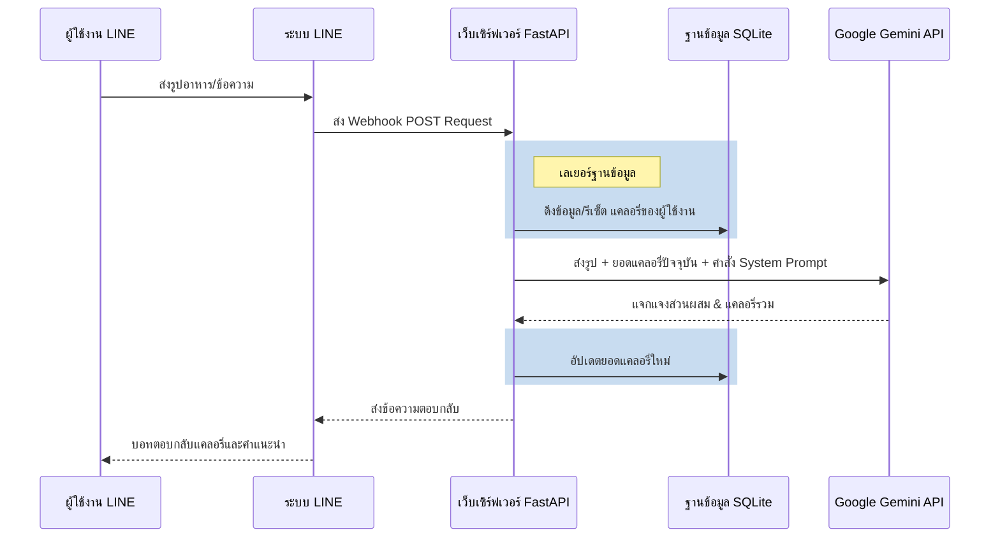

<div align="center">

# 🍲 How Many Cals (AI Nutritionist)

**บอทนักโภชนาการส่วนตัวบน LINE พร้อมใช้งาน พัฒนาด้วย Google Gemini 2.5 Flash** <br>
*ต่อยอดมาจากโปรเจคตั้งต้น [fastapi-line-gemini](https://github.com/welltilln/fastapi-line-gemini)*

<p align="center">
    <a href="README.md">English</a>
    <span>&nbsp;&nbsp;•&nbsp;&nbsp;</span>
    <a href="README-TH.md">ภาษาไทย</a>
    <span>&nbsp;&nbsp;•&nbsp;&nbsp;</span>
    <a href="README-ZH.md">简体中文</a>
    <span>&nbsp;&nbsp;•&nbsp;&nbsp;</span>
    <a href="README-JA.md">日本語</a>
    <span>&nbsp;&nbsp;•&nbsp;&nbsp;</span>
    <a href="README-KO.md">한국어</a>
</p>

[](https://www.python.org/downloads/)
[](https://fastapi.tiangolo.com)
[](https://ai.google.dev/)
[](#)
[](https://opensource.org/licenses/MIT)

</div>

<br/>

## 📖 แนะนำโปรเจค

**How Many Cals** คือ LINE Official Account อัจฉริยะที่ทำหน้าที่เป็นนักโภชนาการส่วนตัวของคุณ ระบบใช้ความสามารถของ Google Gemini Vision เพื่อสแกนรูปภาพอาหารที่คุณส่งมา แล้วแยกแยะส่วนประกอบต่างๆ เพื่อคำนวณแคลอรี่ที่แม่นยำที่สุดให้คุณ

สิ่งที่ทำให้โปรเจคนี้แตกต่างจากบอททั่วไปคือ **ระบบฐานข้อมูล SQLite ป้องกันการความจำเสื่อม** บอทจะจดจำแคลอรี่รวมที่คุณกินเข้าไปในแต่ละวันได้อย่างแม่นยำแม้ว่าเซิร์ฟเวอร์จะดับหรือรีสตาร์ท และยังมาพร้อมกับระบบรีเซ็ตแคลอรี่อัตโนมัติในวันใหม่ เพื่อให้เหมือนมีผู้ช่วยส่วนตัวจริงๆ

---

## ✨ ฟีเจอร์เด่น (Key Features)

* 📸 **วิเคราะห์อาหารอัจฉริยะ:** ส่งรูปอาหารที่ซับซ้อน (เช่น ข้าวราดแกงหลายๆ อย่าง) มาได้เลย บอทจะแยกแยะกับข้าวแต่ละอย่างและคำนวณแคลอรี่ให้
* 🧠 **หน่วยความจำถาวร (SQLite DB):** ประวัติการกินของคุณ (แคลอรี่รวมของวัน) จะถูกบันทึกอย่างปลอดภัยในฐานข้อมูล SQLite ข้อมูลไม่หายแน่นอนเวลาเซิร์ฟเวอร์มีปัญหา
* 🔄 **รีเซ็ตวันใหม่อัตโนมัติ:** บอทจะเช็คเวลาล่าสุดที่คุณเข้ามาคุย ถ้าขึ้นวันใหม่แล้ว แคลอรี่รวมจะถูกรีเซ็ตกลับเป็นศูนย์โดยอัตโนมัติ
* 🎯 **ระบบแก้ไขความผิดพลาด:** หาก AI เดาอาหารผิด หรือให้ข้อมูลพลาด คุณสามารถพิมพ์บอกชื่ออาหารที่ถูกต้องไปได้เลย บอทจะคำนวณและปรับตัวเลขในฐานข้อมูลให้ใหม่ทันที
* **พร้อมใช้งานทันที:** รันโปรเจคได้โดยไม่ต้องปวดหัวกับการเซ็ตอัป ด้วยสคริปต์รันอัตโนมัติ `run.sh` / `run.bat` ที่จะจัดการทั้ง Environment และ Ngrok Tunnels ให้ด้วยคลิกเดียว

---

## 🏗️ โครงสร้างการทำงาน (Architecture)



---

## 🛠️ วิธีติดตั้งและใช้งาน

### สิ่งที่ต้องเตรียม (Prerequisites)
ตรวจสอบให้แน่ใจว่าคุณมีข้อมูลคีย์และ Token เหล่านี้:
1. **[LINE Messaging API](https://developers.line.biz/console/):** `Channel Secret` และ `Channel Access Token`
2. **[Google Gemini API Key](https://aistudio.google.com/):** สมัครรับ API Key ฟรีได้จาก Google AI Studio
3. **[Ngrok Auth Token](https://dashboard.ngrok.com/):** จำเป็นสำหรับการเปิดพอร์ตโลคอลให้ระบบ LINE สามารถเชื่อมต่อเข้ามาได้

### ขั้นตอนที่ 1: ดาวน์โหลดโปรเจค
```bash
git clone https://github.com/welltilln/howmanycals.git
cd howmanycals
```
ก๊อปปี้ไฟล์ `.env.example` แล้วเปลี่ยนชื่อเป็น `.env` จากนั้นใส่ API Key ของคุณลงไปให้ครบ:
```env
LINE_CHANNEL_SECRET=ใส่_secret_ของคุณที่นี่
LINE_CHANNEL_ACCESS_TOKEN=ใส่_token_ของคุณที่นี่
GEMINI_API_KEY=ใส่_gemini_key_ของคุณที่นี่
NGROK_AUTHTOKEN=ใส่_ngrok_token_ของคุณที่นี่
```

### ขั้นตอนที่ 2: รันโปรแกรมในคลิกเดียว (Local)
สำหรับ **MacOS / Linux**:
```bash
./run.sh
```
สำหรับ **Windows**:
```cmd
run.bat
```
*(สคริปต์นี้จะทำการสร้าง Environment เล็กๆ อัตโนมัติ ติดตั้ง Library ที่จำเป็น เปิดเซิร์ฟเวอร์ FastAPI วางฐานข้อมูล `users.db` และเปิดท่อ Ngrok ขึ้นมาให้คุณทันที)*

### ขั้นตอนที่ 3: เชื่อมระบบเข้ากับ LINE
ก๊อปปี้ URL ของ Ngrok ที่ปรากฏขึ้นมาบนหน้าจอ Terminal (เช่น `https://xxxx.ngrok.app/callback`) และนำไปวางในช่อง **Webhook URL** บนหน้าเว็บ LINE Developers Console หลังจากนั้นกด Verify บอทของคุณก็พร้อมใช้งาน!

---

## 🐳 ติดตั้งบนเซิร์ฟเวอร์จริง (Docker)

สำหรับการรันเซิร์ฟเวอร์แบบ 24/7 บน VPS โดยไม่ต้องใช้ Ngrok เราได้เตรียมไฟล์ Docker ไว้ให้เรียบร้อยแล้ว

1. เช็คให้แน่ใจว่ามีโปรแกรม [Docker](https://docs.docker.com/get-docker/) & [Docker Compose](https://docs.docker.com/compose/) บนเซิร์ฟเวอร์ของคุณ
2. รันคำสั่งนี้เพื่อสร้างและรันคอนเทนเนอร์ในโหมด Background:
```bash
docker-compose up -d --build
```
*คำแนะนำ: ไฟล์ฐานข้อมูล `users.db` จะถูกเมานท์ (Mounted) เป็น Volume ไว้ โค้ดหรือคอนเทนเนอร์พังข้อมูลก็ไม่หาย*

---

## 🎨 วิธีเปลี่ยนคาแรคเตอร์ให้บอท (Customization)

โปรเจคนี้ออกแบบมาให้คุณแก้ไขทุกอย่างได้ง่ายมากๆ! คุณไม่จำเป็นต้องเก็บระบบนักโภชนาการนี้ไว้ คุณอาจจะลองแปลงโฉมเป็นเทรนเนอร์จอมดุ หรือนักบัญชีที่คอยด่าเวลาคุณกินของแพงๆ ก็ได้

1. เปิดไฟล์ `gemini.py`
2. หาตรงตัวแปรที่ชื่อ `system_prompt`
3. ลบข้อความในนั้นออก แล้วใส่ชุดคำสั่งใหม่ของคุณเข้าไปแทน

**ตัวอย่างการดัดแปลง Prompt เป็นเทรนเนอร์ดุๆ:**
```python
system_prompt = """
สวมบทบาทเทรนเนอร์เพาะกายสุดดุจอมซาดิสม์!
เวลาผู้ใช้ปาภาพอาหารมาให้ ให้คำนวณแคลอรี่แบบเป๊ะๆ 
ถ้าแคลอรี่มันเกิน 500 ให้ด่ากราด ด่าแบบหยาบคาย และสั่งวิดพื้น 50 ครั้ง

รูปแบบที่คุณต้องตอบ:
🔥 แคลอรี่จานนี้: [ตัวเลข]
🤬 โค้ชขอสั่งสอนว่า: [ด่ามาเลย]
📊 แคลอรี่ที่ยัดไปแล้ววันนี้: [ตัวเลข]
"""
```

---

## 🤖 พัฒนาต่อยอดด้วย
- **[FastAPI](https://fastapi.tiangolo.com/)** - เฟรมเวิร์กสร้างเซิร์ฟเวอร์ยอดฮิตแห่งยุค ควักประสิทธิภาพสูงสุด
- **[Google Generative AI](https://ai.google.dev/)** - สมองกลที่ฉลาดที่สุดจาก Google
- **[LINE Messaging API SDK](https://github.com/line/line-bot-sdk-python)** - ตัวแปรสำคัญในการยิงข้อความ
- **SQLite** - ฐานข้อมูลตัวจิ๋วแต่เสถียร ไม่ต้องเซ็ตแยกให้เหนื่อย

## 📄 ลิขสิทธิ์

โปรเจคนี้เป็น Open Source ควบคุมโดยลิขสิทธิ์อนุญาต MIT License - ดูข้อมูลรายละเอียดได้ในไฟล์ [LICENSE](LICENSE)
