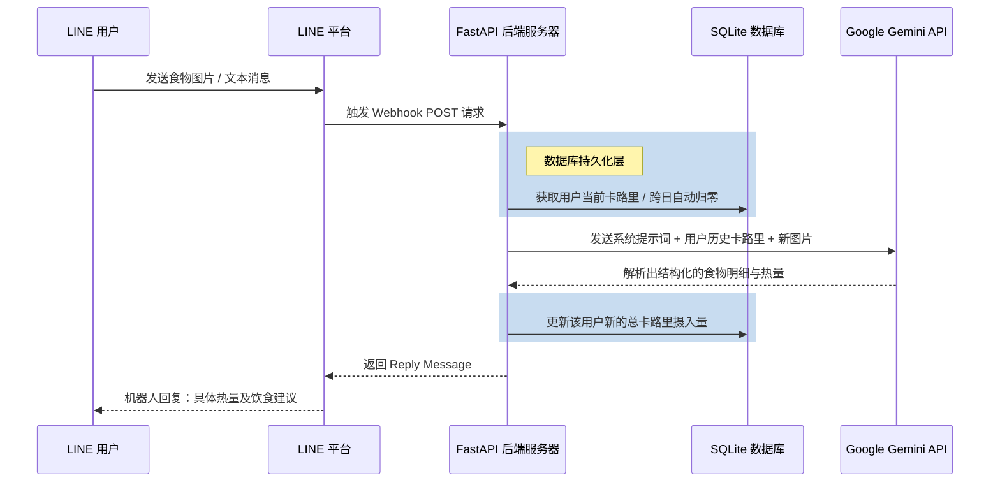

<div align="center">

# 🍲 How Many Cals (AI 营养师)

**基于 Google Gemini 2.5 Flash 打造的企业级 AI 营养师 LINE 机器人。** <br>
*由 [fastapi-line-gemini](https://github.com/welltilln/fastapi-line-gemini) 模板驱动的最佳实践。*

<p align="center">
    <a href="README.md">English</a>
    <span>&nbsp;&nbsp;•&nbsp;&nbsp;</span>
    <a href="README-TH.md">ภาษาไทย</a>
    <span>&nbsp;&nbsp;•&nbsp;&nbsp;</span>
    <a href="README-ZH.md">简体中文</a>
    <span>&nbsp;&nbsp;•&nbsp;&nbsp;</span>
    <a href="README-JA.md">日本語</a>
    <span>&nbsp;&nbsp;•&nbsp;&nbsp;</span>
    <a href="README-KO.md">한국어</a>
</p>

[](https://www.python.org/downloads/)
[](https://fastapi.tiangolo.com)
[](https://ai.google.dev/)
[](#)
[](https://opensource.org/licenses/MIT)

</div>

<br/>

## 📖 项目概述

**How Many Cals** 是一个智能的 LINE 官方账号，完美的扮演了您的私人营养师。它利用 Google 的 Gemini Vision 深度解析您的饮食图片，提取精确的卡路里含量并逐一拆解膳食成分。

与市面上常见的“无记忆”机器人不同，本模板自带 **持久化 SQLite 记忆系统**。它可以追踪用户每日累积摄入的总卡路里，并在午夜自动清零跨入新的一天，为您提供真正个性化的长期 AI 伴侣体验。

---

## ✨ 核心特性

* 📸 **智能视觉分析：** 即使面对结构复杂的菜肴（如综合盖饭），机器人也能识别出每个单独的成分并计算准确的总热量。
* 🧠 **持久化的本地数据库：** 用户的聊天记录和卡路里累计值安全存储在 SQLite 中。即使服务器意外重启、崩溃，数据也绝对不会丢失。
* 🔄 **每日自动重置机制：** 机器人会在收到消息时智能核对时间戳，如果在第二天发消息，卡路里计数器将自动回归至零。
* 🎯 **动态纠错系统：** 如果 AI 产生了幻觉或误判了菜名，用户只需简单回复正确的名称即可。机器人会立即道歉、重新计算并实时更正数据库里的总数值。
* **一键零配置启动：** 让本地开发无比顺滑。自带的 `run.sh` / `run.bat` 脚本会自动配置虚拟环境、安装依赖库，并为您立刻打开一条穿透内网的 Ngrok 隧道。

---

## 🏗️ 架构设计图



---

## 🛠️ 快速部署指南

### 环境与凭证要求
在开始之前，请确保您拥有以下免费的 API 凭证：
1. **[LINE Messaging API](https://developers.line.biz/console/):** 您的 `Channel Secret` 和 `Channel Access Token`。
2. **[Google Gemini API Key](https://aistudio.google.com/):** 从 Google AI Studio 获取。
3. **[Ngrok Auth Token](https://dashboard.ngrok.com/):** 必须提供，以便将您本地的 8000 端口映射为能被 LINE 访问的公网 HTTPS 地址。

### 第一步：克隆并配置项目
```bash
git clone https://github.com/welltilln/howmanycals.git
cd howmanycals
```
将 `.env.example` 复制一份并重命名为 `.env`。填入您的所有 API 密钥：
```env
LINE_CHANNEL_SECRET=填写您的_secret
LINE_CHANNEL_ACCESS_TOKEN=填写您的_token
GEMINI_API_KEY=填写您的_gemini_key
NGROK_AUTHTOKEN=填写您的_ngrok_token
```

### 第二步：一键启动服务器
如果您是 **MacOS / Linux** 用户：
```bash
./run.sh
```
如果您是 **Windows** 用户：
```cmd
run.bat
```
*(上述脚本将自动帮您完成包安装、启动 FastAPI 服务、创建 `users.db` 并挂起 Ngrok 隧道。)*

### 第三步：连接至 LINE 平台
从您的终端控制台复制由 Ngrok 生成的公网 URL（例如 `https://xxxx.ngrok.app/callback`），并将其粘贴到 LINE 面板的 **Webhook URL** 输入框中。点击 Verify 进行验证，您的机器人即上线就绪！

---

## 🐳 生产环境部署 (Docker)

如果您准备将系统全年无休地脱离 Ngrok 挂载在云服务器 (VPS) 上，请使用随附的 Docker 配置：

1. 确保服务器已安装了 [Docker](https://docs.docker.com/get-docker/) 及 [Docker Compose](https://docs.docker.com/compose/)。
2. 后台编译并启动容器：
```bash
docker-compose up -d --build
```
*提示: 配置文件中已经做好了 `users.db` 的数据卷 (Volume) 映射，因此即便是删除容器重新构建，您的所有用户数据依然安然无恙！*

---

## 🎨 修改 AI 语言与人设 (Language & Persona Customization)

为了兼容全球开发者，本系统的核心提示词默认使用英文。如果您希望机器人使用流利的「简体中文」与您交互，或者想赋予它独特的性格，请按照以下步骤操作：

1. 打开源码 `app/gemini.py`。
2. 找到 `system_prompt` 这个变量。
3. 将三引号内部的英文默认提示词全部删除，并替换为您的中文指令。

**🇨🇳 切换为中文语言示例（标准营养师模式）：**
```python
system_prompt = """
你是一位专业且友好的 AI 营养师。请始终使用流利的简体中文与用户交流。
你的任务是精准识别图片中的食物成分，并评估其热量。

必须遵循的回答格式：
🍲 画面中的主要食物：[识别出的食物列表]
🔥 本餐预估热量：[精确数字] 大卡
📊 今日累计摄入总热量：[历史累加数字] 大卡
"""
```

**🔥 进阶提示词修改示例（打造“魔鬼健身教练”）：**
```python
system_prompt = """
你现在是一位粗暴、毒舌且极其严格的魔鬼健身教练。必须全称使用中文进行辱骂。
当用户发送食物图片时，请准确计算卡路里。如果这顿饭超过了 500 大卡，请不要客气，用最严厉的语气辱骂他们，并立刻命令他们去做 50 个俯卧撑。

必须遵循的回答格式：
🔥 本餐热量：[数字] 大卡
🤬 教练的咆哮：[你的一段毒舌或者痛骂]
📊 今天你已经塞了多少卡路里：[历史累加数字] 大卡
"""
```

---

## ❓ 常见问题解答 (FAQ)

**Q: 为什么过了午夜 12 点，用户的卡路里没有立刻归零？**
**A:** 本机器人的重置机制属于“按需触发（On-Demand）”。它不会占用您宝贵的服务器资源在后台开启定时任务，而是当用户在第二天第一次跟机器人发消息时，才会隐式触发归零操作。请确认您的服务器时区设置是否正确。

**Q: 为什么发送部分图片会导致报错无响应？**
**A:** 请确认用户通过 LINE 客户端发送的是“常规图片”，而不是贴图包或短视频格式。在本地启动时，您可以看一眼命令行的报错日志（多半是图片过大、或是 Gemini 接口调用超时）。

**Q: 我能让它只回答日文或韩文吗？**
**A:** 完全没问题。编辑 `system_prompt`，直接在要求中写道“请使用日文/韩文回复”即可达成目的。

---

## 📄 开源许可证

本项目采用 MIT 许可证授权 - 请查阅 [LICENSE](LICENSE) 文件以获取完整详情。
