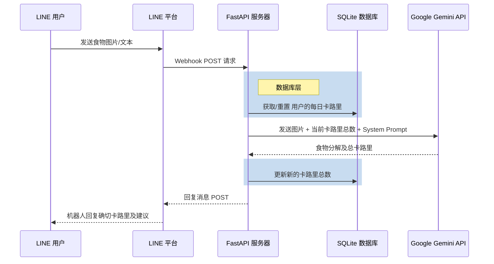

# 🍲 How Many Cals (AI 营养师)

**基于 Google Gemini 2.5 Flash 打造的企业级 AI 营养师 LINE 机器人。**  
*完全基于 [fastapi-line-gemini](https://github.com/welltilln/fastapi-line-gemini) 模板构建。*

    <a href="README.md">English</a>
    &nbsp;&nbsp;•&nbsp;&nbsp;
    <a href="README-TH.md">ภาษาไทย</a>
    &nbsp;&nbsp;•&nbsp;&nbsp;
    <a href="README-ZH.md">简体中文</a>
    &nbsp;&nbsp;•&nbsp;&nbsp;
    <a href="README-JA.md">日本語</a>
    &nbsp;&nbsp;•&nbsp;&nbsp;
    <a href="README-KO.md">한국어</a>

 

## 📖 项目概述

**How Many Cals** 是一个智能 LINE 官方账号，充当您的私人营养师。它利用 Google 的 Gemini Vision API 对您的食物图片进行 X 光透视，精确提取卡路里含量并分解膳食成分。

与典型的无状态机器人不同，此模板具有 **持久化 SQLite 记忆系统**，可跟踪用户每日的卡路里总摄入量并在午夜自动重置，提供真正的 AI 伴侣体验。

---

## ✨ 核心特性

* 📸 **智能视觉分析：** 发送任何复杂菜肴的图片，机器人将识别每一个成分并计算准确的卡路里。
* 🧠 **持久化 SQLite 数据库：** 用户聊天记录（每日总卡路里）安全地存储在本地 SQLite 数据库中，服务器重启后数据不会丢失。
* 🔄 **每日自动重置：** 机器人会智能检查最后一次互动的时间戳。如果新的一天已经开始，卡路里计数会自动重置为零。
* 🎯 **动态纠错系统：** 如果 AI 产生幻觉或误判了菜肴，用户只需发送正确的名称。机器人将立即重新计算并更新数据库。
* **零配置启动：** 体验无摩擦的本地开发。随附的 `run.sh` / `run.bat` 自动脚本可一键实例化虚拟环境和 Ngrok 隧道。

---

## 🏗️ 架构设计

---

## 🛠️ 快速上手

### 前置要求
确保您拥有以下凭证：
1. **[LINE Messaging API](https://developers.line.biz/console/):** `Channel Secret` 和 `Channel Access Token`。
2. **[Google Gemini API Key](https://aistudio.google.com/):** 从 Google AI Studio 获取免费的 API 密钥。
3. **[Ngrok Auth Token](https://dashboard.ngrok.com/):** 需要此令牌将您的本地服务器暴露给 LINE 平台。

### 部署指南详见英文 README.md
