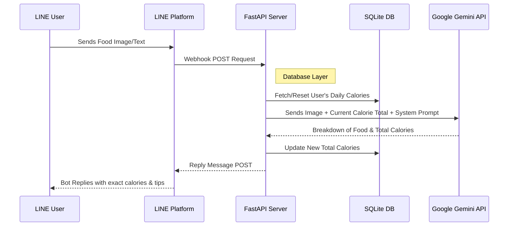

<div align="center">

# How Many Cals (AI Nutritionist)

**A production-ready AI Nutritionist LINE Bot powered by Google Gemini 2.5 Flash.** <br>
*Built entirely on the [fastapi-line-gemini](https://github.com/welltilln/fastapi-line-gemini) boilerplate.*

<p align="center">
    <a href="README.md">English</a>
    <span>&nbsp;&nbsp;&nbsp;&nbsp;</span>
    <a href="docs/README-TH.md"></a>
    <span>&nbsp;&nbsp;&nbsp;&nbsp;</span>
    <a href="docs/README-ZH.md"></a>
    <span>&nbsp;&nbsp;&nbsp;&nbsp;</span>
    <a href="docs/README-JA.md"></a>
    <span>&nbsp;&nbsp;&nbsp;&nbsp;</span>
    <a href="docs/README-KO.md"></a>
</p>

[](https://www.python.org/downloads/)
[](https://fastapi.tiangolo.com)
[](https://ai.google.dev/)
[](#)
[](https://opensource.org/licenses/MIT)

</div>

<br/>

## Overview

**How Many Cals** is an intelligent LINE Official Account that acts as your personal nutritionist. It leverages Google's Gemini Vision to X-ray your food images, extracting exact calorie counts and breaking down meal components.

Unlike typical stateless bots, this template features a **Persistent SQLite Memory System** that tracks a user's total daily calories and automatically resets at midnight, providing a true AI companion experience.

---

## Key Features

* **Smart Vision Analysis:** Send a picture of any complex dish (like mixed curries on rice), and the bot will identify every single component and calculate the exact calories.
* **Persistent SQLite DB:** User chat history (total daily calories) is safely stored in a local SQLite database, surviving server restarts.
* **Automatic Daily Reset:** The bot intelligently checks the timestamp of the last interaction. If a new day has started, the calorie count resets to zero automatically.
* **Dynamic Correction System:** If the AI hallucinates or misidentifies a dish, the user can simply text the correct name. The bot will instantly recalculate and update the database.
* **Zero-Configuration Launch:** Experience frictionless local development. The included `run.sh` / `run.bat` auto-scripts instantiate virtual environments and Ngrok tunnels in one click.

---

## Architecture



---

## Quick Start Guide

### Prerequisites
Before you begin, ensure you have the following credentials:
1. **[LINE Messaging API](https://developers.line.biz/console/):** `Channel Secret` and `Channel Access Token`.
2. **[Google Gemini API Key](https://aistudio.google.com/):** Get a free API key from Google AI Studio.
3. **[Ngrok Auth Token](https://dashboard.ngrok.com/):** Required for exposing your local server to the LINE platform.

### Step 1: Clone & Configure
```bash
git clone https://github.com/welltilln/howmanycals.git
cd howmanycals
```
Duplicate `.env.example` and rename it to `.env`. Fill in your API keys:
```env
LINE_CHANNEL_SECRET=your_secret_here
LINE_CHANNEL_ACCESS_TOKEN=your_token_here
GEMINI_API_KEY=your_gemini_key_here
NGROK_AUTHTOKEN=your_ngrok_token_here
```

### Step 2: 1-Click Launch (Local)
For **MacOS / Linux**:
```bash
./run.sh
```
For **Windows**:
```cmd
run.bat
```
*(The script will automatically install dependencies, start the FastAPI server, create `users.db`, and open an Ngrok tunnel.)*

### Step 3: Connect to LINE
Copy the generated Ngrok URL from your terminal (e.g., `https://xxxx.ngrok.app/callback`) and paste it into the **Webhook URL** field in your LINE Developers Console. Verify it, and your bot is live!

---

## Production Deployment (Docker)

For 24/7 hosting on a Virtual Private Server (VPS) without relying on Ngrok, utilize the included Docker configuration.

1. Ensure [Docker](https://docs.docker.com/get-docker/) & [Docker Compose](https://docs.docker.com/compose/) are installed on your server.
2. Build and run the container in detached mode:
```bash
docker-compose up -d --build
```
*Note: The `users.db` SQLite file is mounted as a volume so your user data persists even if the container is rebuilt.*

---

## Modifying the AI Persona (Customization)

You don't have to keep this bot as a nutritionist. You can easily reprogram the AI to be a fitness coach, a sarcastic accountant, or a strict parent.

1. Open `gemini.py`.
2. Locate the `system_prompt` variable.
3. Replace the text inside the quotes with your new instructions.

**Example Prompt Modification:**
```python
system_prompt = """
You are a brutal, sarcastic fitness coach. 
When the user sends a food image, calculate the calories precisely. If the calories are over 500, scold them intensely and tell them to do 50 pushups.
Format output:
Calories: [Number]
Coach Says: [Your sarcastic comment]
Total Today: [Number]
"""
```

### Upgrading the AI Model (Future-Proofing)
If a newer, smarter Gemini model is released in the future (e.g., Gemini 3.0), you don't need to rewrite the project! Simply open `app/gemini.py` and change the `model_name` string to the new version:
```python
model = genai.GenerativeModel(
  model_name="gemini-3.0-pro", # <-- UPDATE THIS LINE
  ...
)
```

---

## Built With
- **[FastAPI](https://fastapi.tiangolo.com/)** - High performance Python web framework
- **[Google Generative AI](https://ai.google.dev/)** - Gemini 1.5/2.5 Flash Vision Models
- **[LINE Messaging API SDK](https://github.com/line/line-bot-sdk-python)** - For seamless Webhook integrations
- **SQLite** - C-language library that implements a small, fast, self-contained SQL database engine

## License

This project is licensed under the MIT License - see the [LICENSE](LICENSE) file for details.
