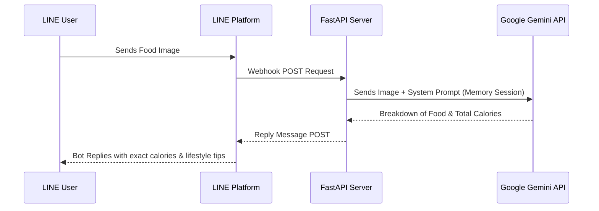

# 🍲 How Many Cals? (Kin Ni Uan Mai Na?)

[](https://www.python.org/downloads/)
[](https://fastapi.tiangolo.com)
[](https://ai.google.dev/)
[](https://opensource.org/licenses/MIT)

An AI-powered LINE bot that acts as your personal nutritionist! Built entirely on top of the [fastapi-line-gemini template](https://github.com/welltilln/fastapi-line-gemini), this bot uses Google's Gemini 2.5 Flash to automatically analyze food images, extract exact calorie counts, reads meal components, and track daily calorie intake using Gemini's native session memory.

## Architecture

*How Many Cals* is a production-ready implementation of the [FastAPI-LINE-Gemini Connector](https://github.com/welltilln/fastapi-line-gemini).



## Features
- **Zero-Configuration Launch**: Run the app instantly via local tunneling using the `run.sh` / `run.bat` auto scripts.
- **Smart Vision (Food X-Ray)**: Send a dynamic image (e.g. rice with mixed curries) and the bot breaks down every single component.
- **Daily Memory Tracking**: Retains context of previous meals throughout the day, providing an ongoing total of daily calorie consumption.
- **Correction System**: If the bot hallucinates or misidentifies a dish, you can send a correction text, and it recalculates the memory state immediately.
- **Next-Meal Recommendations**: Recommends future meal adjustments based on what you have already eaten today.

## Prerequisites
1. Python 3.9 or higher.
2. [LINE Messaging API Credentials](https://developers.line.biz/console/): `Channel Secret` and `Channel Access Token`.
3. [Google Gemini API Key](https://aistudio.google.com/).
4. [Ngrok Auth Token](https://dashboard.ngrok.com/): Required for local development.

## Setup Instructions

### Local Development

1. Clone this repository.
2. Rename `.env.example` to `.env` and assign your API credentials.
3. Execute the startup script appropriate for your operating system:
   - **MacOS / Linux:** `./run.sh`
   - **Windows:** `run.bat`

The script will launch the FastAPI server and expose it via Ngrok. 
Copy the generated Webhook URL (e.g., `https://xxxx.ngrok.app/callback`) and configure it in your LINE Developers Console.

### Production Deployment (Docker)

For 24/7 production hosting on a traditional VPS securely without Ngrok, utilize the provided Docker configuration.

1. Ensure [Docker](https://docs.docker.com/get-docker/) & [Docker Compose](https://docs.docker.com/compose/) are installed.
2. Build and run the container in detached mode:
   ```bash
   docker-compose up -d --build
   ```

## License

This project is licensed under the MIT License - see the [LICENSE](LICENSE) file for details.
