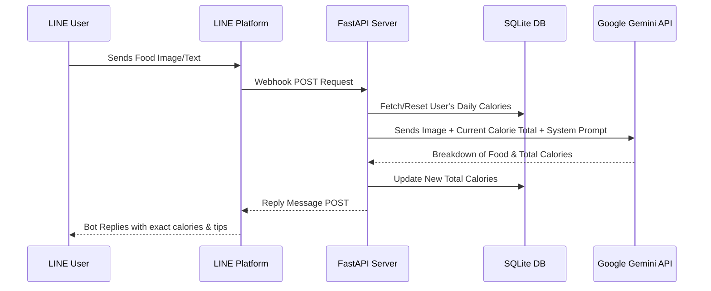

# 🍲 How Many Cals (AI Nutritionist Bot)

[](https://www.python.org/downloads/)
[](https://fastapi.tiangolo.com)
[](https://ai.google.dev/)
[](#)
[](https://opensource.org/licenses/MIT)

An AI-powered LINE bot that acts as your personal nutritionist! Built on top of the [fastapi-line-gemini template](https://github.com/welltilln/fastapi-line-gemini), this bot uses Google's Gemini 2.5 Flash to automatically analyze food images, extract exact calorie counts, and track daily calorie intake using a **persistent SQLite database** with **automatic daily resets**.

## 🏗️ Architecture



## ✨ Core Features
- **Smart Vision (Food X-Ray)**: Send a dynamic image (e.g., rice with mixed curries) and the bot breaks down every single component.
- **Persistent Memory Tracking (SQLite)**: Tracks the total calories consumed throughout the day. Unlike typical bots, the memory is stored securely in a local database (`users.db`), meaning data survives server restarts.
- **Automatic Daily Reset**: The bot automatically checks the date. If it's a new day, your total calories reset to 0 upon your first message.
- **Correction System**: If the bot hallucinates or misidentifies a dish, reply with the correct name. It will recalculate and adjust the database instantly.
- **Zero-Configuration Launch**: Run the app instantly via local tunneling using the `run.sh` / `run.bat` auto scripts.

---

## 🛠️ Setup Instructions

### Prerequisites
1. Python 3.9 or higher.
2. [LINE Messaging API Credentials](https://developers.line.biz/console/): `Channel Secret` and `Channel Access Token`.
3. [Google Gemini API Key](https://aistudio.google.com/).
4. [Ngrok Auth Token](https://dashboard.ngrok.com/): Required for local development.

### Local Development (1-Click Run)

1. Clone this repository:
   ```bash
   git clone https://github.com/welltilln/howmanycals.git
   cd howmanycals
   ```
2. Rename `.env.example` to `.env` and fill in your API credentials.
3. Execute the startup script for your OS:
   - **MacOS / Linux:** `./run.sh`
   - **Windows:** `run.bat`

The script will launch the FastAPI server, create the initial `users.db` database, and expose it via Ngrok. Copy the generated Webhook URL (e.g., `https://xxxx.ngrok.app/callback`) and configure it in your LINE Developers Console.

### Production Deployment (Docker)

For 24/7 production hosting on a VPS without Ngrok, utilize the provided Docker configuration.
```bash
docker-compose up -d --build
```
*(Note: Ensure your Docker volume mounts `users.db` correctly if you want to persist the data if the container is destroyed).*

---

## 🎨 How to Customize Your Bot

This template is designed to be easily modified! You don't have to keep it as a generic nutritionist. You can change the bot's personality to be strict, cute, or sarcastic.

### Modifying the Prompt
Open the `gemini.py` file and locate the `system_prompt` variable. Edit the instructions inside the quotes to change how the AI behaves:

```python
system_prompt = """
You are a helpful and kind AI Nutritionist connected via a LINE bot.

Core Rules for Answering:
... [Edit these rules to fit your desired persona!] ...
"""
```

**Tips for a good prompt:**
1. Tell Gemini exactly **how** to format the final message (e.g., using emojis, bullet points).
2. Remind the AI that it will be receiving the "Current Calorie Total" from the system in the background, and it must output the combined total back to the user.

---

## 📝 License

This project is licensed under the MIT License - see the [LICENSE](LICENSE) file for details.
