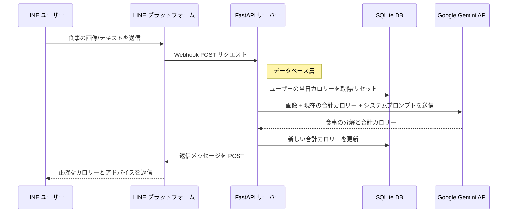

<div align="center">

# How Many Cals (AI 栄養士)

**Google Gemini 2.5 Flash を搭載した、実戦向けの AI 栄養士 LINE ボット。** <br>
*[fastapi-line-gemini](https://github.com/welltilln/fastapi-line-gemini) ボイラープレートをベースに構築されています。*

<p align="center">
    <a href="../README.md"></a>
    <a href="./README-TH.md"></a>
    <a href="./README-ZH.md"></a>
    <a href="./README-JA.md"></a>
    <a href="./README-KO.md"></a>
</p>

[](https://www.python.org/downloads/)
[](https://fastapi.tiangolo.com)
[](https://ai.google.dev/)
[](#)
[](https://opensource.org/licenses/MIT)

</div>

<br/>

## 概要

**How Many Cals** は、あなたの専属栄養士として機能するインテリジェントな LINE 公式アカウントです。Google の Gemini Vision を活用して食事の画像をスキャンし、正確なカロリー数を抽出して料理の構成要素を分解します。

一般的なステートレスなボットとは異なり、このテンプレートは **永続的な SQLite メモリシステム** を備えています。これにより、ユーザーの毎日の総カロリーを追跡し、深夜に自動的にリセットする、真の AI コンパニオン体験を提供します。

---

## 主な機能

*   **スマートビジョン分析:** 複雑な料理（ご飯に乗った複数のカレーなど）の写真を送るだけで、ボットがすべての構成要素を特定し、正確なカロリーを計算します。
*   **永続的な SQLite DB:** ユーザーのチャット履歴（毎日の総カロリー）はローカルの SQLite データベースに安全に保存され、サーバーの再起動後も保持されます。
*   **自動デイリーリセット:** ボットは最後のインタラクションのタイムスタンプをインテリジェントにチェックします。新しい日が始まっている場合、カロリーカウントは自動的にゼロにリセットされます。
*   **ダイナミック修正システム:** AI が料理を誤認した場合、ユーザーは正しい名前をテキストで送るだけで済みます。ボットは即座に再計算し、データベースを更新します。
*   **ゼロコンフィグ起動:** 同梱の `run.sh` / `run.bat` スクリプトを使用すると、仮想環境の構築から Ngrok トンネルの作成までをワンクリックで実行でき、スムーズなローカル開発が可能です。

---

## アーキテクチャ



---

## クイックスタートガイド

### 事前準備
開始する前に、以下の認証情報を準備してください：
1.  **[LINE Messaging API](https://developers.line.biz/console/):** `Channel Secret` と `Channel Access Token`。
2.  **[Google Gemini API Key](https://aistudio.google.com/):** Google AI Studio から無料の API キーを取得。
3.  **[Ngrok Auth Token](https://dashboard.ngrok.com/):** ローカルサーバーを LINE プラットフォームに公開するために必要です。

### ステップ 1: クローンと設定
```bash
git clone https://github.com/welltilln/howmanycals.git
cd howmanycals
```
`.env.example` をコピーして `.env` にリネームし、API キーを記入します：
```env
LINE_CHANNEL_SECRET=your_secret_here
LINE_CHANNEL_ACCESS_TOKEN=your_token_here
GEMINI_API_KEY=your_gemini_key_here
NGROK_AUTHTOKEN=your_ngrok_token_here
```

### ステップ 2: ワンクリック起動 (ローカル)
**MacOS / Linux** の場合:
```bash
./run.sh
```
**Windows** の場合:
```cmd
run.bat
```
*(スクリプトは自動的に依存関係をインストールし、FastAPI サーバーを起動し、`users.db` を作成し、Ngrok トンネルを開きます。)*

### ステップ 3: LINE への接続
ターミナルに表示された Ngrok URL（例: `https://xxxx.ngrok.app/callback`）をコピーし、LINE Developers Console の **Webhook URL** フィールドに貼り付けて保存（Verify）してください。

---

## 本番環境へのデプロイ (Docker)

Ngrok に頼らずに VPS などで 24 時間稼働させる場合は、同梱の Docker 設定を使用します。

1.  サーバーに [Docker](https://docs.docker.com/get-docker/) & [Docker Compose](https://docs.docker.com/compose/) がインストールされていることを確認します。
2.  バックグラウンドモードでビルドして実行します：
```bash
docker-compose up -d --build
```
*注: `users.db` ファイルはボリュームとしてマウントされているため、コンテナを再構築してもユーザーデータは保持されます。*

---

## AI の性格のカスタマイズ

このボットは栄養士以外にも変更可能です。フィットネスコーチや、皮肉屋の会計士、厳格な親のようにプログラムし直すことができます。

1.  `app/gemini.py` を開きます。
2.  `system_prompt` 変数を見つけます。
3.  引用符内のテキストを新しい指示に書き換えます。

**プロンプト変更の例:**
```python
system_prompt = """
あなたは非常に厳しく、皮肉屋なフィットネスコーチです。
ユーザーが食事の画像を送ってきたら、カロリーを正確に計算してください。もし 500 カロリーを超えていたら、激しく叱りつけ、腕立て伏せを 50 回するように命じてください。
出力フォーマット:
カロリー: [数値]
コーチのコメント: [皮肉なコメント]
今日の合計: [数値]
"""
```

---

## FAQ

**Q: 今日の摂取カロリーが深夜にリセットされないのはなぜですか？**
**A:** このボットは「オンデマンド・ロジック」で動作します。リセットは、深夜を過ぎた後にユーザーが最初にメッセージを送信した時にトリガーされます。

**Q: 画像を送るとエラーになります。**
**A:** ターミナルのログを確認してください。多くの場合、画像サイズが大きすぎるか、Gemini API のタイムアウトが原因です。

## ライセンス

このプロジェクトは MIT ライセンスの下でライセンスされています。詳細は [LICENSE](../LICENSE) ファイルを参照してください。