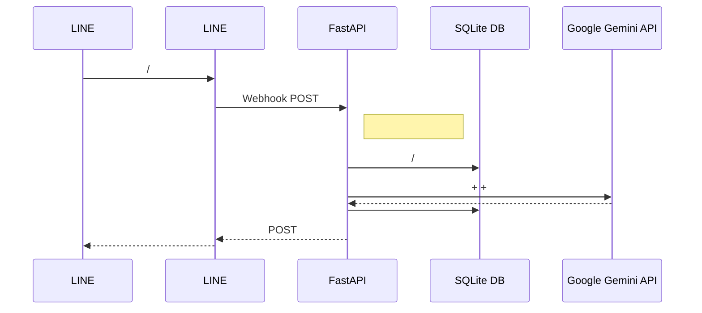

<div align="center">

# How Many Cals (AI )

**Google Gemini 2.5 Flash  AI  LINE ** <br>
*[fastapi-line-gemini](https://github.com/welltilln/fastapi-line-gemini) *

<p align="center">
    <a href="../README.md"></a>
    <a href="README-TH.md"></a>
    <a href="README-ZH.md"></a>
    <a href="README-JA.md"></a>
    <a href="README-KO.md"></a>
</p>

[](https://www.python.org/downloads/)
[](https://fastapi.tiangolo.com)
[](https://ai.google.dev/)
[](#)
[](https://opensource.org/licenses/MIT)

</div>

<br/>

## 

**How Many Cals**  LINE Google  Gemini Vision 

 ** SQLite **  AI 

---

## 

*   **:** 
*   ** SQLite DB:**  SQLite 
*   **:** 
*   **:** AI 
*   **:**  `run.sh` / `run.bat`  Ngrok 

---

## 



---

## 

### 

1.  **[LINE Messaging API](https://developers.line.biz/console/):** `Channel Secret`  `Channel Access Token`
2.  **[Google Gemini API Key](https://aistudio.google.com/):** Google AI Studio  API 
3.  **[Ngrok Auth Token](https://dashboard.ngrok.com/):**  LINE 

###  1: 
```bash
git clone https://github.com/welltilln/howmanycals.git
cd howmanycals
```
`.env.example`  `.env` API 
```env
LINE_CHANNEL_SECRET=your_secret_here
LINE_CHANNEL_ACCESS_TOKEN=your_token_here
GEMINI_API_KEY=your_gemini_key_here
NGROK_AUTHTOKEN=your_ngrok_token_here
```

###  2:  ()
**MacOS / Linux** :
```bash
./run.sh
```
**Windows** :
```cmd
run.bat
```
*(FastAPI `users.db` Ngrok )*

###  3: LINE 
 Ngrok URL: `https://xxxx.ngrok.app/callback`LINE Developers Console  **Webhook URL** Verify

---

##  (Docker)

Ngrok  VPS  24  Docker 

1.   [Docker](https://docs.docker.com/get-docker/) & [Docker Compose](https://docs.docker.com/compose/) 
2.  
```bash
docker-compose up -d --build
```
*: `users.db` *

---

## AI 


1.  `app/gemini.py` 
2.  `system_prompt` 
3.  

**:**
```python
system_prompt = """

 500  50 
:
: []
: []
: []
"""
```

---

## FAQ

**Q: **
**A:** 

**Q: **
**A:** Gemini API 

## 

 MIT  [LICENSE](../LICENSE) 