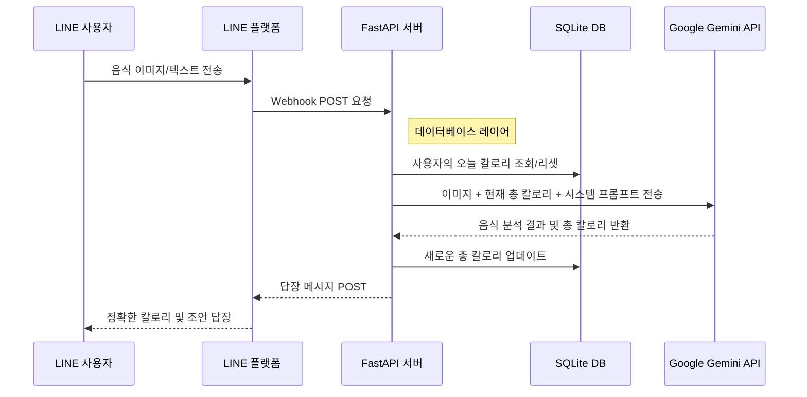

<div align="center">

# How Many Cals (AI 영양사)

**Google Gemini 2.5 Flash를 탑재한 실전형 AI 영양사 LINE 봇.** <br>
*[fastapi-line-gemini](https://github.com/welltilln/fastapi-line-gemini) 보일러플레이트를 기반으로 구축되었습니다.*

<p align="center">
    <a href="../README.md">English</a>
    <span>&nbsp;&nbsp;•&nbsp;&nbsp;</span>
    <a href="README-TH.md">ภาษาไทย</a>
    <span>&nbsp;&nbsp;•&nbsp;&nbsp;</span>
    <a href="README-ZH.md">简体中文</a>
    <span>&nbsp;&nbsp;•&nbsp;&nbsp;</span>
    <a href="README-JA.md">日本語</a>
    <span>&nbsp;&nbsp;•&nbsp;&nbsp;</span>
    <a href="README-KO.md">한국어</a>
</p>

[](https://www.python.org/downloads/)
[](https://fastapi.tiangolo.com)
[](https://ai.google.dev/)
[](#)
[](https://opensource.org/licenses/MIT)

</div>

<br/>

## 개요

**How Many Cals**는 개인 영양사 역할을 하는 지능형 LINE 공식 계정입니다. Google Gemini Vision을 사용하여 음식 이미지를 분석하고, 정확한 칼로리를 추출하며 식단 구성 요소를 상세히 분석합니다.

일반적인 상태 비저장(stateless) 봇과 달리, 이 템플릿은 **영구 SQLite 메모리 시스템**을 갖추고 있어 사용자의 일일 총 칼로리를 추적하고 자정에 자동으로 리셋하는 진정한 AI 동반자 경험을 제공합니다.

---

## 주요 기능

*   **스마트 비전 분석:** 복잡한 요리(예: 밥 위의 여러 가지 반찬) 사진을 보내면 봇이 모든 구성 요소를 식별하고 정확한 칼로리를 계산합니다.
*   **영구 SQLite DB:** 사용자의 채팅 기록(일일 총 칼로리)은 로컬 SQLite 데이터베이스에 안전하게 저장되어 서버 재시작 후에도 유지됩니다.
*   **자동 일일 리셋:** 봇은 마지막 상호작용의 타임스탬프를 지능적으로 확인하여 새로운 날이 시작되면 칼로리 카운트를 자동으로 0으로 리셋합니다.
*   **동적 로직 수정:** AI가 음식을 잘못 인식한 경우 사용자가 올바른 이름을 텍스트로 보내기만 하면 됩니다. 봇은 즉시 다시 계산하여 데이터베이스를 업데이트합니다.
*   **제로 컨피그 실행:** 포함된 `run.sh` / `run.bat` 스크립트를 사용하면 가상 환경 구축부터 Ngrok 터널 생성까지 한 번의 클릭으로 로컬 개발 환경을 완성할 수 있습니다.

---

## 아키텍처



---

## 퀵 스타트 가이드

### 사전 준비
시작하기 전에 다음 인증 정보를 준비하세요:
1.  **[LINE Messaging API](https://developers.line.biz/console/):** `Channel Secret` 및 `Channel Access Token`.
2.  **[Google Gemini API Key](https://aistudio.google.com/):** Google AI Studio에서 무료 API 키 발급.
3.  **[Ngrok Auth Token](https://dashboard.ngrok.com/):** 로컬 서버를 LINE 플랫폼에 노출하기 위해 필요합니다.

### 1단계: 프로젝트 클론 및 설정
```bash
git clone https://github.com/welltilln/howmanycals.git
cd howmanycals
```
`.env.example`을 복사하여 `.env`로 이름을 바꾸고 API 키를 입력합니다:
```env
LINE_CHANNEL_SECRET=your_secret_here
LINE_CHANNEL_ACCESS_TOKEN=your_token_here
GEMINI_API_KEY=your_gemini_key_here
NGROK_AUTHTOKEN=your_ngrok_token_here
```

### 2단계: 클릭 한 번으로 실행 (로컬)
**MacOS / Linux**:
```bash
./run.sh
```
**Windows**:
```cmd
run.bat
```
*(스크립트가 자동으로 의존성을 설치하고, FastAPI 서버를 실행하며, `users.db`를 생성하고 Ngrok 터널을 엽니다.)*

### 3단계: LINE 연결
터미널에 표시된 Ngrok URL(예: `https://xxxx.ngrok.app/callback`)을 복사하여 LINE Developers Console의 **Webhook URL** 필드에 붙여넣고 Verify를 누르세요.

---

## 운영 환경 배포 (Docker)

Ngrok 없이 VPS 등에서 24시간 호스팅하려면 포함된 Docker 설정을 사용하세요.

1.  서버에 [Docker](https://docs.docker.com/get-docker/) 및 [Docker Compose](https://docs.docker.com/compose/)가 설치되어 있는지 확인합니다.
2.  데몬 모드로 빌드 및 실행합니다:
```bash
docker-compose up -d --build
```
*참고: `users.db` 파일은 볼륨으로 마운트되어 있어 컨테이너를 재구축해도 사용자 데이터가 유지됩니다.*

---

## AI 페르소나 커스터마이징

이 봇은 영양사 외에도 다양한 역할로 변경할 수 있습니다. 피트니스 코치, 냉소적인 회계사 또는 엄격한 부모처럼 프로그래밍할 수 있습니다.

1.  `app/gemini.py`를 엽니다.
2.  `system_prompt` 변수를 찾습니다.
3.  따옴표 안의 텍스트를 새로운 지침으로 바꿉니다.

**프롬프트 수정 예시:**
```python
system_prompt = """
당신은 매우 엄격하고 냉소적인 피트니스 코치입니다.
사용자가 음식 이미지를 보내면 칼로리를 정확하게 계산하세요. 칼로리가 500을 넘으면 강하게 질책하고 팔굽혀펴기 50개를 하라고 명령하세요.
출력 형식:
칼로리: [숫자]
코치의 한마디: [냉소적인 멘트]
오늘 총합: [숫자]
"""
```

---

## FAQ

**Q: 오늘 섭취 칼로리가 자정에 리셋되지 않습니다.**
**A:** 이 봇은 "온디맨드 로직"으로 작동합니다. 리셋은 자정이 지난 후 사용자가 첫 메시지를 보낼 때 트리거됩니다.

**Q: 이미지를 보냈는데 에러가 납니다.**
**A:** 터미널 로그를 확인하세요. 이미지 용량이 너무 크거나 Gemini API 타임아웃인 경우가 많습니다.

## 라이선스

이 프로젝트는 MIT 라이선스에 따라 라이선스가 부여됩니다. 자세한 내용은 [LICENSE](../LICENSE) 파일을 참조하십시오.
