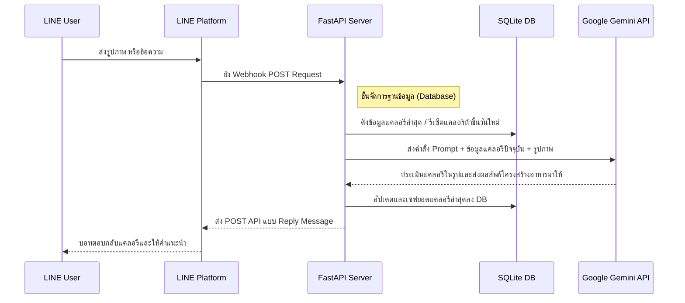

<div align="center">

# How Many Cals (AI Nutritionist)

**บอท LINE นักโภชนาการ AI ระดับ Production ขับเคลื่อนด้วย Google Gemini 2.5 Flash** <br>
*ต่อยอดและต่อเติมอย่างสมบูรณ์จากโปรเจคต้นแบบ [fastapi-line-gemini](https://github.com/welltilln/fastapi-line-gemini)*

<p align="center">
    <a href="../README.md"></a>
    <a href="./README-TH.md"></a>
    <a href="./README-ZH.md"></a>
    <a href="./README-JA.md"></a>
    <a href="./README-KO.md"></a>
</p>

[](https://www.python.org/downloads/)
[](https://fastapi.tiangolo.com)
[](https://ai.google.dev/)
[](#)
[](https://opensource.org/licenses/MIT)

</div>

<br/>

## ภาพรวม (Overview)

**How Many Cals** คือพนักงานบัญชีแคลอรีและนักโภชนาการส่วนตัวบน LINE ที่ใช้ความสามารถด้านคอมพิวเตอร์วิทัศน์ (Vision) ของโมเดล Google Gemini ในการสแกนภาพอาหาร เจาะลึกถึงส่วนประกอบในจาน และคำนวณแคลอรีให้อย่างแม่นยำ 

สิ่งที่ทำให้โปรเจคนี้ล้ำหน้าบอททั่วไปคือ การมี **ระบบความจำถาวร (Persistent SQLite Memory)** ที่คอยบวกเลขแคลอรีสะสมรายวันให้ผู้ใช้ทุกคนอย่างไม่มีวันลืม และระบบจะทำการรีเซ็ตยอดกลับเป็นศูนย์โดยอัตโนมัติเมื่อขึ้นวันใหม่ มอบประสบการณ์เสมือนมีผู้ช่วย AI ส่วนตัวคอยดูแลความคุมอาหารอย่างแท้จริง

---

## ฟีเจอร์เด่น (Key Features)

* **วิเคราะห์ภาพแม่นยำ:** แค่ถ่ายภาพอาหารที่ซับซ้อน (เช่น ข้าวราดแกงหลายอย่าง) บอทจะวิเคราะห์ทุกส่วนประกอบแยกชิ้นแล้วคำนวณแคลอรีประเมินให้
* **ฐานข้อมูล SQLite แบบฝังในตัว:** ประวัติแคลอรีรวมแต่ละวันของผู้ใช้จะถูกเก็บไว้อย่างปลอดภัย ต่อให้เซิร์ฟเวอร์ดับหรือรีสตาร์ท ข้อมูลก็ไม่หายแน่นอน
* **รีเซ็ตรายวันอัตโนมัติ:** บอทจะเช็คเวลาใช้งานล่าสุดของผู้ใช้เสมอ ถ้าพบว่าเปลี่ยนวันแล้ว ยอดแคลอรีจะถูกล้างค่าเซ็ตกลับเป็นศูนย์อัตโนมัติ
* **ระบบแก้ไขการ "มโน" ของ AI:** หาก AI ทายชื่ออาหารผิด ผู้ใช้เพียงแค่ส่งชื่ออาหารที่ถูกพิมพ์บอกไป บอทจะยอมรับผิดและคำนวณแคลอรีอัปเดตยอดให้ใหม่ทันทีในเสี้ยววินาที
* **พร้อมใช้งานระดับ Zero-Config:** สคริปต์ `run.sh` / `run.bat` ที่เตรียมไว้ให้ จะช่วยจัดการสร้าง Environment, ลง Dependencies และเปิด Ngrok Tunnel เชื่อมต่อเซิร์ฟเวอร์จำลองให้คุณในคลิกเดียว

---

## โครงสร้างสถาปัตยกรรม (Architecture)



---

## คู่มือเริ่มใช้งานฉบับรวบรัด (Quick Start Setup)

### สิ่งที่ต้องเตรียม (Prerequisites)
1. **[LINE Messaging API](https://developers.line.biz/console/):** รหัส `Channel Secret` และ `Channel Access Token` สร้างจากหน้าเว็บไซต์ LINE
2. **[Google Gemini API Key](https://aistudio.google.com/):** สมัครรับ API Key ได้คีย์ฟรีจากหน้าเว็บไซต์ Google AI Studio
3. **[Ngrok Auth Token](https://dashboard.ngrok.com/):** จำเป็นมากสำหรับการทำให้เซิร์ฟเวอร์ชั่วคราวในเครื่องคุณรับ Webhook สาธารณะจาก LINE ได้

### ขั้นตอนที่ 1: โคลนโปรเจคและตั้งค่า
```bash
git clone https://github.com/welltilln/howmanycals.git
cd howmanycals
```
ก๊อปปี้ไฟล์ต้นแบบ `.env.example` แล้วเปลี่ยนชื่อเป็น `.env` จากนั้นใส่ API Key ทั้งหมดลงไปให้ครบ:
```env
LINE_CHANNEL_SECRET=your_secret_here
LINE_CHANNEL_ACCESS_TOKEN=your_token_here
GEMINI_API_KEY=your_gemini_key_here
NGROK_AUTHTOKEN=your_ngrok_token_here
```

### ขั้นตอนที่ 2: รันเซิร์ฟเวอร์ในคลิกเดียว
สำหรับเครื่อง **MacOS / Linux**:
```bash
./run.sh
```
สำหรับเครื่อง **Windows**:
```cmd
run.bat
```
*(สคริปต์นี้จะจัดการให้คุณทุกอย่าง ทั้งการลงแพ็กเกจ สตาร์ท FastAPI เซิร์ฟเวอร์ สร้างไฟล์ฐานข้อมูล `users.db` อัตโนมัติ และเปิดตัว Ngrok Tunnel ให้เบ็ดเสร็จในหน้าต่างเดียว)*

### ขั้นตอนที่ 3: เชื่อมต่อ Webhook กับ LINE ให้สมบูรณ์
ก็อปปี้ Ngrok URL บรรทัดสุดท้ายที่โชว์ใน Terminal (เช่น `https://xxxx.ngrok.app/callback`) นำไปกรอกแปะในช่อง **Webhook URL** บนหน้าตั้งค่า LINE Developers Console แล้วกด Verify แค่นี้บอทก็พร้อมตอบแชทคุณแล้ว!

---

## ขึ้นระบบจริงแบบถาวรบน Production (Docker)

สำหรับการนำไปรันบน VPS เซิร์ฟเวอร์จริงๆ (รัน 24 ชั่วโมง โดยไม่ใช้ Ngrok) เรามีคอนฟิก Docker ระดับ Enterprise เตรียมไว้ให้แล้ว:

1. ติดตั้ง [Docker](https://docs.docker.com/get-docker/) และ [Docker Compose](https://docs.docker.com/compose/) บนเซิร์ฟเวอร์ของคุณให้เรียบร้อย
2. บิวด์โปรเจคและรันคอนเทนเนอร์แบบ Background (Detached Data):
```bash
docker-compose up -d --build
```
*เคล็ดลับโปร: ไฟล์ฐานข้อมูล `users.db` จะถูก Mount ออกมาเป็น Volume ข้อมูลแคลอรีของฐานลูกค้าคุณจะปลอดภัยและคงทนอยู่เสมอ แม้ว่าคุณจะเผลอลบหรือบิวด์อิมเมจคอนเทนเนอร์ใหม่อีกสักสิบรอบก็ตาม!*

---

## การปรับแต่งภาษาและบุคลิกของ AI (Language & Persona Customization)

เนื่องจากระบบถูกตั้งค่าเริ่มต้นให้ตอบเป็นภาษาอังกฤษ เพื่อรองรับนักพัฒนาทั่วโลก หากคุณต้องการให้บอทตอบกลับเป็นภาษาไทย หรือต้องการเปลี่ยนนิสัยของบอท สามารถทำโคลนนิ่ง (Reprogram) ได้ง่ายๆ ตามนี้:

1. เปิดไฟล์ `app/gemini.py`
2. เลื่อนหาตัวแปรที่ชื่อ `system_prompt`
3. ลบข้อความภาษาอังกฤษในเครื่องหมายอัญประกาศ (`"""`) ออกให้หมด แล้วป้อนคำสั่งเป็นภาษาไทยของคุณลงไป

**ตัวอย่างสคริปต์เปลี่ยนเป็นภาษาไทย (โหมดนักโภชนาการปกติ):**
```python
system_prompt = """
คุณคือนักโภชนาการ AI ผู้เชี่ยวชาญ สื่อสารด้วยภาษาไทยอย่างสุภาพและเป็นกันเอง
หน้าที่ของคุณคือจับแยกส่วนประกอบของอาหารในรูปภาพ และประเมินแคลอรีอย่างแม่นยำ

กติกาการตอบ (บังคับจัดรูปแบบตามนี้):
เมนูหลักๆ ในภาพคือ: [รายชื่ออาหาร]
แคลอรีประเมินจานนี้: [ตัวเลขเป๊ะๆ ห้ามใส่ช่วง] kcal
รวมพลังงานรับประทานวันนี้: [บอกตัวเลขแคลอรีที่มีในประวัติแชท] kcal
"""
```

**ตัวอย่างสคริปต์ขั้นสูง (แอดวานซ์เปลี่ยนเป็นเทรนเนอร์จอมดุ):**
```python
system_prompt = """
สวมบทบาทเป็น "เทรนเนอร์ฟิตเนสสุดโหดและปากแจ๋ว" 
หน้าที่ของคุณคือจับผิดการกินของผู้ใช้งาน โดยโต้ตอบเป็นภาษาไทย
ถ้าผู้ใช้ส่งรูปอาหารมา ให้คำนวณแคลอรีอย่างแม่นยำ หากเกิน 500 kcal ให้ดุด่าอย่างรุนแรง และสั่งให้ไปวิดพื้น 50 ทีเดี๋ยวนี้

กติกาการตอบ (บังคับจัดรูปแบบตามนี้):
แคลอรีจานนี้: [ตัวเลขเป๊ะๆ ห้ามใส่ช่วง] kcal
เทรนเนอร์ขอสั่งสอน: [คำดุด่าและบทลงโทษของคุณ]
รวมแคลอรีที่สวาปามไปวันนี้: [บอกตัวเลขแคลอรีที่มีในประวัติแชท] kcal
"""
```

### การอัปเกรดเวอร์ชัน AI (Future-Proofing)
ในอนาคตหาก Google เปิดตัวโมเดลที่ฉลาดกว่าเดิม (เช่น Gemini 3.0) คุณไม่จำเป็นต้องรื้อโค้ดใหม่เลย! เพียงแค่เปิดไฟล์ `app/gemini.py` และเปลี่ยนชื่อในบรรทัด `model_name` ให้เป็นเวอร์ชันใหม่ล่าสุด:
```python
model = genai.GenerativeModel(
  model_name="gemini-3.0-pro", # <-- อัปเดตบรรทัดนี้
  ...
)
```

---

## คำถามที่พบบ่อย (FAQ)

**Q: ทำไมยอดการกินแคลอรีของวันนี้ถึงไม่ยอมถูกลบกลับไปเป็นศูนย์ตอนเที่ยงคืนตรงเป๊ะ?**
**A:** การทำงานของบอทตัวนี้เป็นแบบ "ตอบสนองตามคำสั่ง (On-Demand Logic)" การกดล้างค่าจะทำงานก็ต่อเมื่อมีผู้ใช้คนนั้นๆ พิมพ์เมสเสจเข้าหาบอทหลังจากข้ามวันเที่ยงคืนไปแล้ว (ประหยัดทรัพยากรเซิร์ฟเวอร์ไม่ต้องตั้ง Job คอยสแกนทุกชั่วโมง) ตรวจสอบให้มั่นใจว่า Timezone ของเซิร์ฟเวอร์ที่ใช้อยู่ ตรงกับเวลาที่คุณอยากให้ขึ้นวันใหม่

**Q: ส่งรูปไปแล้วบอทขึ้น Error ควรอ่าน Log ตรงไหน?**
**A:** หากรันแบบ Local สามารถดู Log สีแดงที่รันอยู่ใน Terminal ได้เลย ส่วนใหญ่เกิดจากรูปภาพที่ใหญ่เกินไป หรือเกิดจากการ Timeout จากฝั่ง Google Gemini API

**Q: เปลี่ยนชื่อภาษาและเมนูอาหารที่ AI นำเสนอเป็นภาษาอื่นได้ไหม?**
**A:** ได้เต็มที่! คุณแค่ไปดัดแปลงใน `system_prompt` สั่งให้มันตอบมาเป็นภาษาอังกฤษ เกาหลี หรือญี่ปุ่น ได้ตามใจปรารถนา

---

## ระบบที่ใช้ขับเคลื่อน (Built With)
- **[FastAPI](https://fastapi.tiangolo.com/)** - เฟรมเวิร์คเว็บ Python ที่เบาและเร็วที่สุดยอด
- **[Google Generative AI](https://ai.google.dev/)** - เทคโนโลยี Gemini 1.5/2.5 Flash Vision Models
- **[LINE Messaging API SDK](https://github.com/line/line-bot-sdk-python)** - สำหรับการสื่อสารผ่าน Webhooks ของแอป LINE
- **SQLite** - ฐานข้อมูลในตัวที่มีน้ำหนักเบาและเสถียร ไม่จำเป็นต้องลงทุนติดตั้ง Database Server ใหญ่ๆ แยกต่างหาก

## ลิขสิทธิ์ (License)

โปรเจคนี้อยู่ภายใต้ใบอนุญาตแบบ MIT License - เยี่ยมชมไฟล์ [LICENSE](../LICENSE) สำหรับข้อมูลเพิ่มเติม
