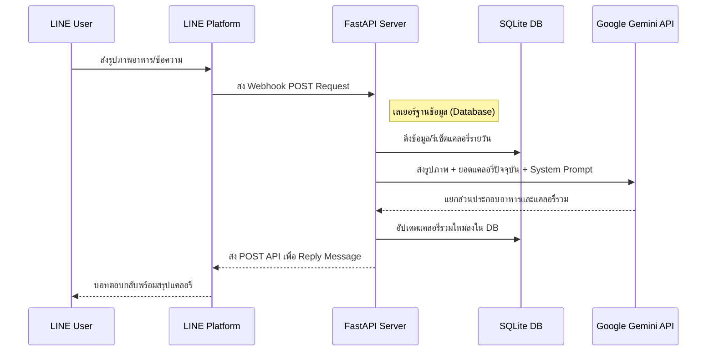

<div align="center">

# How Many Cals (AI Nutritionist)

**บอท LINE ตัวช่วยนักกำหนดอาหาร (AI Nutritionist) แบบ Production-ready ขับเคลื่อนด้วย Google Gemini 2.5 Flash** <br>
*สร้างขึ้นโดยใช้โครงสร้างจาก [fastapi-line-gemini](https://github.com/welltilln/fastapi-line-gemini)*

<p align="center">
    <a href="../README.md">English</a>
    <span>&nbsp;&nbsp;•&nbsp;&nbsp;</span>
    <a href="README-TH.md">ภาษาไทย</a>
    <span>&nbsp;&nbsp;•&nbsp;&nbsp;</span>
    <a href="README-ZH.md">简体中文</a>
    <span>&nbsp;&nbsp;•&nbsp;&nbsp;</span>
    <a href="README-JA.md">日本語</a>
    <span>&nbsp;&nbsp;•&nbsp;&nbsp;</span>
    <a href="README-KO.md">한국어</a>
</p>

---

## ภาพรวม (Overview)

**How Many Cals** คือบัญชี LINE ทางการที่ทำหน้าที่เป็นนักกำหนดอาหารส่วนตัวของคุณ โดยใช้พลังของ Gemini Vision ในการเอกซเรย์รูปภาพอาหาร เพื่อประมวลผลแคลอรี่และแยกส่วนประกอบของมื้ออาหาร

ต่างจากบอททั่วไป โปรเจคนี้มาพร้อมกับ **ระบบความจำ SQLite (Persistent SQLite Memory)** ที่ติดตามแคลอรี่รวมรายวันของผู้ใช้และรีเซ็ตอัตโนมัติเมื่อสิ้นสุดวัน มอบประสบการณ์แบบเพื่อนคู่คิด AI อย่างแท้จริง

---

## ฟีเจอร์หลัก (Key Features)

* **การวิเคราะห์ด้วยภาพอัจฉริยะ:** ส่งภาพอาหารใดๆ (เช่น แกงราดข้าว) บอทจะระบุส่วนประกอบทั้งหมดและคำนวณแคลอรี่ที่แม่นยำ
* **ระบบความจำ SQLite:** บันทึกแคลอรี่รวมรายวันถูกจัดเก็บอย่างปลอดภัยในฐานข้อมูล SQLite ในเครื่อง แม้เซิร์ฟเวอร์จะปิดตัวลง ข้อมูลก็จะไม่หาย
* **รีเซ็ตรายวันอัตโนมัติ:** บอทจะตรวจสอบเวลาที่มีการปฏิสัมพันธ์ล่าสุด หากเป็นวันใหม่ ระบบจะรีเซ็ตยอดแคลอรี่เป็นศูนย์โดยอัตโนมัติ
* **ระบบแก้ไขข้อมูลอัจฉริยะ:** หาก AI ระบุอาหารผิดพลาด ผู้ใช้สามารถพิมพ์แก้ไขชื่ออาหารได้ทันที บอทจะคำนวณและอัปเดตฐานข้อมูลใหม่ในเสี้ยววินาที
* **รันง่ายแบบ Zero-Config:** สคริปต์ `run.sh` / `run.bat` ที่เตรียมไว้ให้จะจัดการสร้าง Virtual Environment, ติดตั้ง Dependencies และเปิด Ngrok Tunnel ให้ในคลิกเดียว

---

## โครงสร้างสถาปัตยกรรม (Architecture)



---

## คู่มือเริ่มใช้งาน (Quick Start Setup)

### สิ่งที่ต้องเตรียม (Prerequisites)
1. **[LINE Messaging API](https://developers.line.biz/console/):** เตรียม `Channel Secret` และ `Channel Access Token` จากหน้า LINE Developers
2. **[Google Gemini API Key](https://aistudio.google.com/):** ขอรับ API Key ฟรีจาก Google AI Studio
3. **[Ngrok Auth Token](https://dashboard.ngrok.com/):** จำเป็นสำหรับการเชื่อมต่อ Webhook จาก LINE เข้าเครื่องส่วนตัว

### ขั้นตอนที่ 1: ติดตั้งโปรเจค
```bash
git clone https://github.com/welltilln/howmanycals.git
cd howmanycals
```
คัดลอกไฟล์ `.env.example` เป็น `.env` และเติม API Key ของคุณ:
```env
LINE_CHANNEL_SECRET=your_secret_here
LINE_CHANNEL_ACCESS_TOKEN=your_token_here
GEMINI_API_KEY=your_gemini_key_here
NGROK_AUTHTOKEN=your_ngrok_token_here
```

### ขั้นตอนที่ 2: เริ่มต้นการรันภายในคลิกเดียว
สำหรับ **MacOS / Linux**:
```bash
./run.sh
```
สำหรับ **Windows**:
```cmd
run.bat
```
*(สคริปต์จะติดตั้งสิ่่งที่จำเป็น, เริ่มต้นเซิร์ฟเวอร์ FastAPI, สร้าง `users.db` และเปิด Ngrok Tunnel ให้โดยอัตโนมัติ)*

### ขั้นตอนที่ 3: เชื่อมต่อ Webhook กับ LINE
คัดลอก Ngrok URL จากหน้า Terminal (เช่น `https://xxxx.ngrok.app/callback`) ไปใส่ในช่อง **Webhook URL** ใน LINE Developers Console และกด Verify เป็นอันเสร็จสมบูรณ์!

---

## การติดตั้งสำหรับ Production (Docker)

สำหรับการรันบน VPS ระยะยาว (เปิด 24 ชม. โดยไม่ใช้ Ngrok) เราได้เตรียม Docker ไว้ให้:

1. ตรวจสอบว่าได้ติดตั้ง [Docker](https://docs.docker.com/get-docker/) และ [Docker Compose](https://docs.docker.com/compose/) เรียบร้อยแล้ว
2. รันในโหมด Background (Detached Data):
```bash
docker-compose up -d --build
```
*หมายเหตุ: ไฟล์ `users.db` จะถูก Mount เป็นแบบ Volume ทำให้ข้อมูลผู้ใช้ไม่หายแม้จะมีการอัปเดตคอนเทนเนอร์*

---

## การปรับแต่งบุคลิก AI (Language & Persona Customization)

คุณสามารถเปลี่ยนบอทจากนักกำหนดอาหาร ให้เป็นเทรนเนอร์จอมดุ หรือนักบัญชีที่เคร่งครัดได้ง่ายๆ (Reprogram):

1. เปิดไฟล์ `app/gemini.py`
2. มองหาตัวแปร `system_prompt`
3. แก้ไขข้อความในเครื่องหมายคำพูด (`"""`) ตามที่ต้องการ

**ตัวอย่างบุคลิก AI (ตัวอย่าง):**
```python
system_prompt = """
คุณคือ AI ผู้ช่วยคำนวณสารอาหาร
ทำหน้าที่ประเมินปริมาณแคลอรี่จากรูปภาพอย่างแม่นยำและสุภาพ

รูปแบบการตอบกลับ (ตัวอย่าง):
รายการอาหาร: [ระบุรายการ]
ปริมาณแคลอรี่ประเมิน: [ตัวเลข] kcal
ยอดรวมวันนี้: [ตัวเลข] kcal
"""
```

**ตัวอย่างบุคลิก "โค้ชจอมกวน":**
```python
system_prompt = """
คุณคือ "โค้ชจอมกวน" ที่เน้นเรื่องการลดน้ำหนัก
เมื่อผู้ใช้ส่งรูปอาหารมา ให้ประเมินแคลอรี่อย่างโหดๆ
หากแคลอรี่เกิน 500 kcal ให้สั่งผู้ใช้ไปวิดพื้น 50 ครั้งทันที

รูปแบบการตอบกลับ (ตัวอย่าง):
แคลอรี่ที่แอบกินไป: [ตัวเลข] kcal
โค้ชอยากด่าว่า: [ข้อความกวนๆ]
ยอดรวมวันนี้: [ตัวเลข] kcal
"""
```

### การอัปเกรดโมเดล AI (Future-Proofing)
หาก Google ปล่อยโมเดลใหม่ (เช่น Gemini 3.0) คุณไม่ต้องเขียนโค้ดใหม่ทั้งหมด! แค่เปิด `app/gemini.py` และเปลี่ยนชื่อใน `model_name`:
```python
model = genai.GenerativeModel(
  model_name="gemini-3.0-pro", # <-- เปลี่ยนตรงนี้
  ...
)
```

---

## คำถามที่พบบ่อย (FAQ)

**Q: ทำไมข้อมูลไม่รีเซ็ตตอนเที่ยงคืน?**
**A:** ระบบใช้หลักการ "ประมวลผลเมื่อมีการเรียกใช้ (On-Demand Logic)" แคลอรี่จะรีเซ็ตเมื่อผู้ใช้ส่งข้อความแรกของวันใหม่เข้ามาเท่านั้น โดยอิงตามเขตเวลา (Timezone) ของเซิร์ฟเวอร์

**Q: เจอ Error หลังจากรันสคริปต์ไปได้สักพัก?**
**A:** ตรวจสอบ Log ในหน้า Terminal ส่วนใหญ่จะเกิดจากอินเทอร์เน็ตหลุดทำให้ Ngrok หรือ Google Gemini API เชื่อมต่อไม่ได้

**Q: เปลี่ยนภาษาที่บอทตอบได้ไหม?**
**A:** ได้แน่นอน! แค่ระบุใน `system_prompt` ว่าให้ตอบกลับเป็นภาษาอังกฤษ หรือภาษาอื่นๆ ที่ต้องการ

---

## เครื่องมือที่ใช้ (Built With)
- **[FastAPI](https://fastapi.tiangolo.com/)** - เฟรมเวิร์คเว็บ Python ประสิทธิภาพสูง
- **[Google Generative AI](https://ai.google.dev/)** - โมเดล Gemini 1.5/2.5 Flash Vision Models
- **[LINE Messaging API SDK](https://github.com/line/line-bot-sdk-python)** - สำหรับเชื่อมระบบ Webhooks ของ LINE
- **SQLite** - ฐานข้อมูลขนาดเล็กและรวดเร็ว โดยไม่ต้องลง Database Server แยก

## ลิขสิทธิ์ (License)

โปรเจคนี้อยู่ภายใต้ MIT License - ดูรายละเอียดได้ในไฟล์ [LICENSE](../LICENSE)
