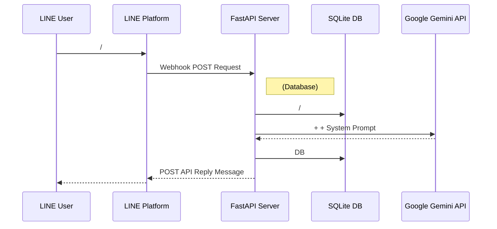

<div align="center">

# How Many Cals (AI Nutritionist)

** LINE  (AI Nutritionist)  Production-ready  Google Gemini 2.5 Flash** <br>
* [fastapi-line-gemini](https://github.com/welltilln/fastapi-line-gemini)*

<p align="center">
    <a href="../README.md">English</a>
    <span>&nbsp;&nbsp;&nbsp;&nbsp;</span>
    <a href="README-TH.md"></a>
    <span>&nbsp;&nbsp;&nbsp;&nbsp;</span>
    <a href="README-ZH.md"></a>
    <span>&nbsp;&nbsp;&nbsp;&nbsp;</span>
    <a href="README-JA.md"></a>
    <span>&nbsp;&nbsp;&nbsp;&nbsp;</span>
    <a href="README-KO.md"></a>
</p>

---

##  (Overview)

**How Many Cals**  LINE   Gemini Vision  

  ** SQLite (Persistent SQLite Memory)**   AI 

---

##  (Key Features)

* **:**  ( ) 
* ** SQLite:**  SQLite   
* **:**   
* **:**  AI   
* ** Zero-Config:**  `run.sh` / `run.bat`  Virtual Environment,  Dependencies  Ngrok Tunnel 

---

##  (Architecture)



---

##  (Quick Start Setup)

###  (Prerequisites)
1. **[LINE Messaging API](https://developers.line.biz/console/):**  `Channel Secret`  `Channel Access Token`  LINE Developers
2. **[Google Gemini API Key](https://aistudio.google.com/):**  API Key  Google AI Studio
3. **[Ngrok Auth Token](https://dashboard.ngrok.com/):**  Webhook  LINE 

###  1: 
```bash
git clone https://github.com/welltilln/howmanycals.git
cd howmanycals
```
 `.env.example`  `.env`  API Key :
```env
LINE_CHANNEL_SECRET=your_secret_here
LINE_CHANNEL_ACCESS_TOKEN=your_token_here
GEMINI_API_KEY=your_gemini_key_here
NGROK_AUTHTOKEN=your_ngrok_token_here
```

###  2: 
 **MacOS / Linux**:
```bash
./run.sh
```
 **Windows**:
```cmd
run.bat
```
*(,  FastAPI,  `users.db`  Ngrok Tunnel )*

###  3:  Webhook  LINE
 Ngrok URL  Terminal ( `https://xxxx.ngrok.app/callback`)  **Webhook URL**  LINE Developers Console  Verify !

---

##  Production (Docker)

 VPS  ( 24 .  Ngrok)  Docker :

1.  [Docker](https://docs.docker.com/get-docker/)  [Docker Compose](https://docs.docker.com/compose/) 
2.  Background (Detached Data):
```bash
docker-compose up -d --build
```
*:  `users.db`  Mount  Volume *

---

##  AI (Language & Persona Customization)

   (Reprogram):

1.  `app/gemini.py`
2.  `system_prompt`
3.  (`"""`) 

** AI ():**
```python
system_prompt = """
 AI 


 ():
: []
: [] kcal
: [] kcal
"""
```

** "":**
```python
system_prompt = """
 "" 
 
 500 kcal  50 

 ():
: [] kcal
: []
: [] kcal
"""
```

###  AI (Future-Proofing)
 Google  ( Gemini 3.0) !  `app/gemini.py`  `model_name`:
```python
model = genai.GenerativeModel(
  model_name="gemini-3.0-pro", # <-- 
  ...
)
```

---

##  (FAQ)

**Q: ?**
**A:**  " (On-Demand Logic)"   (Timezone) 

**Q:  Error ?**
**A:**  Log  Terminal  Ngrok  Google Gemini API 

**Q: ?**
**A:** !  `system_prompt`   

---

##  (Built With)
- **[FastAPI](https://fastapi.tiangolo.com/)** -  Python 
- **[Google Generative AI](https://ai.google.dev/)** -  Gemini 1.5/2.5 Flash Vision Models
- **[LINE Messaging API SDK](https://github.com/line/line-bot-sdk-python)** -  Webhooks  LINE
- **SQLite** -   Database Server 

##  (License)

 MIT License -  [LICENSE](../LICENSE)
 