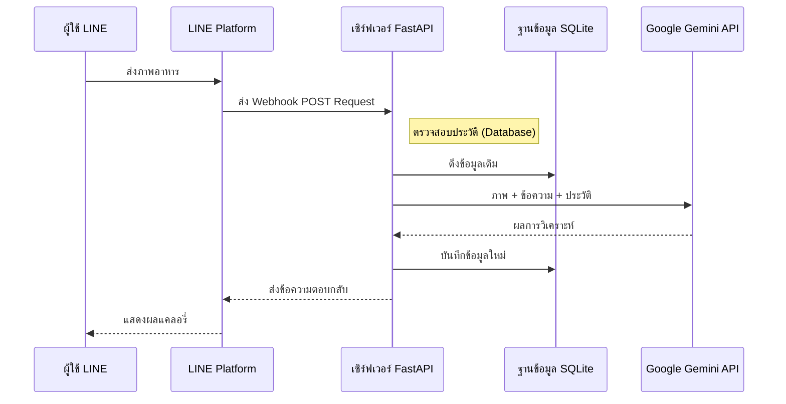

<div align="center">

# How Many Cals (AI Nutritionist)

**ระบบนักโภชนาการ AI พร้อมใช้งานบน LINE พัฒนาด้วย Google Gemini 2.5 Flash** <br>
*สร้างโดยใช้ [fastapi-line-gemini](https://github.com/welltilln/fastapi-line-gemini) boilerplate*

<p align="center">
    <a href="../README.md"></a>
    <a href="README-TH.md"></a>
    <a href="README-ZH.md"></a>
    <a href="README-JA.md"></a>
    <a href="README-KO.md"></a>
</p>

---

## ภาพรวม (Overview)

**How Many Cals** คือ LINE Official Account ที่ใช้พลังของ Gemini Vision ในการวิเคราะห์ภาพอาหารและคำนวณแคลอรี่โดยอัตโนมัติ

แอปพลิเคชันนี้ใช้ **ฐานข้อมูล SQLite แบบถาวร** เพื่อจดจำบริบทของผู้ใช้ ทำให้ AI สามารถตอบสนองได้อย่างเป็นส่วนตัวตามประวัติการสนทนา

---

## ฟีเจอร์หลัก (Key Features)

* **วิเคราะห์ภาพอาหาร:** ส่งภาพอาหารเพื่อให้ AI คำนวณแคลอรี่และสารอาหาร
* **หน่วยความจำ SQLite:** บันทึกประวัติการใช้งานรายบุคคลเพื่อความต่อเนื่อง
* **รองรับหลายภาษา:** ตอบโต้ได้ทั้งภาษาไทยและอังกฤษ
* **ความเร็วสูง:** ใช้โมเดล Gemini Flash เพื่อการประมวลผลที่รวดเร็ว
* **ตั้งค่าง่าย:** มาพร้อมสคริปต์ `run.sh` / `run.bat` ที่จัดการ Virtual Environment และ Ngrok ให้โดยอัตโนมัติ

---

## สถาปัตยกรรม (Architecture)



---

## การเริ่มใช้งานอย่างรวดเร็ว (Quick Start)

### สิ่งที่ต้องเตรียม
1. **[LINE Messaging API](https://developers.line.biz/console/):** รับ `Channel Secret` และ `Channel Access Token`
2. **[Google Gemini API Key](https://aistudio.google.com/):** รับ API Key จาก Google AI Studio
3. **[Ngrok Auth Token](https://dashboard.ngrok.com/):** สำหรับการทำ Webhook บนเครื่อง Local

### ขั้นตอนที่ 1: ติดตั้ง
```bash
git clone https://github.com/welltilln/howmanycals.git
cd howmanycals
```
คัดลอก `.env.example` เป็น `.env` และใส่ API Key ของคุณ:
```env
LINE_CHANNEL_SECRET=ใส่รหัสที่นี่
LINE_CHANNEL_ACCESS_TOKEN=ใส่โทเค็นที่นี่
GEMINI_API_KEY=ใส่คีย์ที่นี่
NGROK_AUTHTOKEN=ใส่โทเค็นที่นี่
```

### ขั้นตอนที่ 2: รันโปรแกรม
**MacOS / Linux**:
```bash
./run.sh
```
**Windows**:
```cmd
run.bat
```
*(สคริปต์จะติดตั้งDependencies, สร้าง `users.db` และเปิด Ngrok ให้โดยอัตโนมัติ)*

### ขั้นตอนที่ 3: ตั้งค่า Webhook
คัดลอก URL จาก Ngrok (เช่น `https://xxxx.ngrok.app/callback`) ไปวางในช่อง **Webhook URL** ใน LINE Developers Console และกด Verify

---

## การใช้งานบน Production (Docker)

สำหรับการรันบน VPS หรือเซิร์ฟเวอร์ที่ต้องการความคงทน ไม่ต้องใช้ Ngrok:

1. ตรวจสอบว่ามี [Docker](https://docs.docker.com/get-docker/) และ [Docker Compose](https://docs.docker.com/compose/)
2. รันคำสั่ง:
```bash
docker-compose up -d --build
```
*หมายเหตุ: ข้อมูลใน `users.db` จะถูกเก็บไว้ใน Volume ต่อให้ลบคอนเทนเนอร์ ข้อมูลก็ยังอยู่*

---

## การปรับแต่งตัวตนของ AI (Persona Customization)

คุณสามารถเปลี่ยนนิสัยหรือภาษาของ AI ได้ง่ายๆ:

1. เปิดไฟล์ `app/gemini.py`
2. แก้ไขตัวแปร `system_prompt`
3. เขียนคำอธิบายตัวตนที่ต้องการลงไป

---

## คำถามที่พบบ่อย (FAQ)

**Q: ข้อมูลมีการเก็บรักษาอย่างไร?**
**A:** ทุกการสนทนาจะถูกผูกกับ LINE User ID และเก็บลงในไฟล์ SQLite ในเครื่อง

**Q: ทำไมภาพไม่แสดงผล?**
**A:** ตรวจสอบ Log ใน Terminal ว่า Ngrok ทำงานปกติหรือไม่ และ API Key ของ Google ยังใช้งานได้อยู่หรือไม่

---

## พัฒนาด้วย
- **[FastAPI](https://fastapi.tiangolo.com/)**
- **[Google Generative AI](https://ai.google.dev/)**
- **[LINE Messaging API SDK](https://github.com/line/line-bot-sdk-python)**
- **SQLite**

## ลิขสิทธิ์ (License)
MIT License - ดูรายละเอียดใน [LICENSE](../LICENSE)
