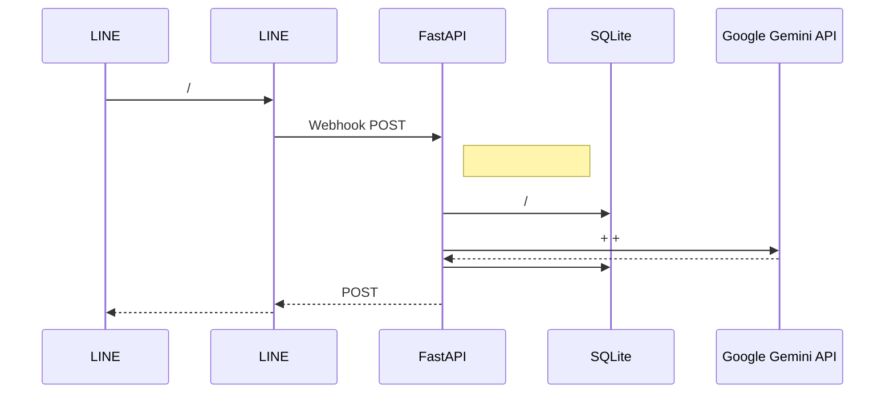

<div align="center">

# How Many Cals (AI )

** Google Gemini 2.5 Flash  AI  LINE ** <br>
* [fastapi-line-gemini](https://github.com/welltilln/fastapi-line-gemini) *

<p align="center">
    <a href="../README.md">English</a>
    <span>&nbsp;&nbsp;&nbsp;&nbsp;</span>
    <a href="README-TH.md"></a>
    <span>&nbsp;&nbsp;&nbsp;&nbsp;</span>
    <a href="README-ZH.md"></a>
    <span>&nbsp;&nbsp;&nbsp;&nbsp;</span>
    <a href="README-JA.md"></a>
    <span>&nbsp;&nbsp;&nbsp;&nbsp;</span>
    <a href="README-KO.md"></a>
</p>

[](https://www.python.org/downloads/)
[](https://fastapi.tiangolo.com)
[](https://ai.google.dev/)
[](#)
[](https://opensource.org/licenses/MIT)

</div>

<br/>

## 

**How Many Cals**  LINE  Google Gemini Vision 

 ** SQLite ** AI 

---

## 

*   **** 
*   ** SQLite **  SQLite 
*   **** 
*   ****  AI 
*   ****  `run.sh` / `run.bat`  Ngrok 

---

## 



---

## 

### 

1.  **[LINE Messaging API](https://developers.line.biz/console/):** `Channel Secret`  `Channel Access Token`
2.  **[Google Gemini API Key](https://aistudio.google.com/):**  Google AI Studio  API 
3.  **[Ngrok Auth Token](https://dashboard.ngrok.com/):** 

### 
```bash
git clone https://github.com/welltilln/howmanycals.git
cd howmanycals
```
 `.env.example`  `.env` API 
```env
LINE_CHANNEL_SECRET=your_secret_here
LINE_CHANNEL_ACCESS_TOKEN=your_token_here
GEMINI_API_KEY=your_gemini_key_here
NGROK_AUTHTOKEN=your_ngrok_token_here
```

###  ()
**MacOS / Linux**:
```bash
./run.sh
```
**Windows**:
```cmd
run.bat
```
*( FastAPI  `users.db`  Ngrok )*

###  LINE
 Ngrok URL`https://xxxx.ngrok.app/callback` LINE Developers Console  **Webhook URL**  Verify

---

##  (Docker)

 VPS  24  Ngrok Docker 

1.   [Docker](https://docs.docker.com/get-docker/)  [Docker Compose](https://docs.docker.com/compose/)
2.  
```bash
docker-compose up -d --build
```
*`users.db` SQLite *

---

##  AI 


1.   `app/gemini.py`
2.   `system_prompt` 
3.  

****
```python
system_prompt = """

 500 50 

[]
[]
[]
"""
```

---

##  (FAQ)

**Q: **
**A:** 

**Q: **
**A:**  Gemini API 

## 

 MIT  [LICENSE](../LICENSE) 