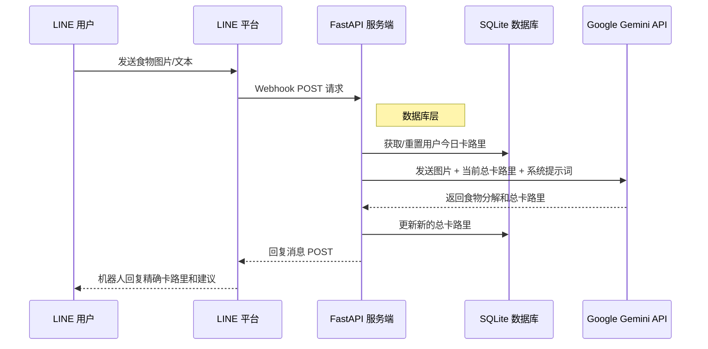

<div align="center">

# How Many Cals (AI 营养师)

**基于 Google Gemini 2.5 Flash 的生产级 AI 营养师 LINE 机器人。** <br>
*完全基于 [fastapi-line-gemini](https://github.com/welltilln/fastapi-line-gemini) 样板构建。*

<p align="center">
    <a href="../README.md"></a>
    <a href="./README-TH.md"></a>
    <a href="./README-ZH.md"></a>
    <a href="./README-JA.md"></a>
    <a href="./README-KO.md"></a>
</p>

[](https://www.python.org/downloads/)
[](https://fastapi.tiangolo.com)
[](https://ai.google.dev/)
[](#)
[](https://opensource.org/licenses/MIT)

</div>

<br/>

## 项目概述

**How Many Cals** 是一个智能 LINE 官方账号，充当您的私人营养师。它利用 Google Gemini Vision 技术的视觉分析能力，扫描您的食物图像，提取精确的卡路里数值并分解餐食成分。

与典型的无状态机器人不同，该模板具有 **持久化 SQLite 记忆系统**，可跟踪用户的每日总卡路里，并在午夜自动重置，提供真实的 AI 伴侣体验。

---

## 核心功能

*   **智能视觉分析：** 发送任何复杂菜肴（如盖浇饭）的照片，机器人将识别每一个组成部分并计算确切的卡路里。
*   **持久化 SQLite 数据库：** 用户聊天历史（每日总卡路里）安全地存储在本地 SQLite 数据库中，即使服务器重启也不会丢失。
*   **自动每日重置：** 机器人会智能检查最后一次交互的时间戳。如果新的一天已经开始，卡路里计数会自动重置为零。
*   **动态修正系统：** 如果 AI 误判了菜名，用户只需通过文本发送正确名称，机器人将立即重新计算并更新数据库。
*   **零配置启动：** 内置 `run.sh` / `run.bat` 脚本，可一键自动创建虚拟环境、安装依赖并开启 Ngrok 隧道。

---

## 架构



---

## 快速入门指南

### 前项准备
在开始之前，请准备好以下凭据：
1.  **[LINE Messaging API](https://developers.line.biz/console/):** `Channel Secret` 和 `Channel Access Token`。
2.  **[Google Gemini API Key](https://aistudio.google.com/):** 从 Google AI Studio 获取免费 API 密钥。
3.  **[Ngrok Auth Token](https://dashboard.ngrok.com/):** 用于将您的本地服务器映射到公网。

### 第一步：克隆并配置
```bash
git clone https://github.com/welltilln/howmanycals.git
cd howmanycals
```
复制 `.env.example` 并重命名为 `.env`，填入您的 API 密钥：
```env
LINE_CHANNEL_SECRET=your_secret_here
LINE_CHANNEL_ACCESS_TOKEN=your_token_here
GEMINI_API_KEY=your_gemini_key_here
NGROK_AUTHTOKEN=your_ngrok_token_here
```

### 第二步：一键运行 (本地)
**MacOS / Linux**:
```bash
./run.sh
```
**Windows**:
```cmd
run.bat
```
*(脚本将自动安装依赖，启动 FastAPI 服务，创建 `users.db` 并开启 Ngrok 隧道。)*

### 第三步：连接 LINE
从终端复制生成的 Ngrok URL（例如：`https://xxxx.ngrok.app/callback`），并将其粘贴到 LINE Developers Console 中的 **Webhook URL** 字段。点击 Verify，您的机器人就上线了！

---

## 生产环境部署 (Docker)

如果要在 VPS 上 24 小时运行而不依赖 Ngrok，请使用内置的 Docker 配置。

1.  确保服务器已安装 [Docker](https://docs.docker.com/get-docker/) 和 [Docker Compose](https://docs.docker.com/compose/)。
2.  以分离模式构建并运行容器：
```bash
docker-compose up -d --build
```
*注意：`users.db` SQLite 文件已挂载为数据卷，因此即使重新构建容器，用户数据也会保留。*

---

## 自定义 AI 人设

您可以轻松地将此机器人重新编程。您可以让它成为一名健身教练、毒舌会计师，或是一位严厉的家长。

1.  打开 `app/gemini.py`。
2.  找到 `system_prompt` 变量。
3.  将引号内的文本替换为您的新指令。

**修改提示词示例：**
```python
system_prompt = """
你是一位非常严厉且毒舌的健身教练。
当用户发送食物图片时，请准确计算卡路里。如果卡路里超过 500，请严厉责骂他们并命令他们立刻做 50 个俯卧撑。
输出格式：
卡路里：[数值]
教练点评：[你的毒舌评论]
今日总计：[数值]
"""
```

---

## 常见问题 (FAQ)

**Q: 为什么卡路里计数在午夜没有重置？**
**A:** 机器人的逻辑是“按需重置”。只有在午夜过后，用户发送新消息时，它才会触发重置检查。

**Q: 发送图片后报错。**
**A:** 请检查终端日志。通常是因为图片文件过大或 Gemini API 响应超时。

## 开源协议

本项目采用 MIT 协议。详见 [LICENSE](../LICENSE) 文件。